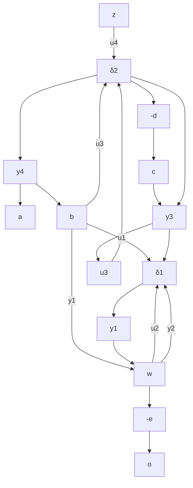

Figure 9.6: Block diagram for G

2. Mark the inputs and outputs of the $\delta \mathrm { { s } }$ as $y ^ { \prime } \mathrm { s }$ and u’s, respectively. (This is essentially pulling out the $\Delta ^ { \prime } s . )$ )   
3. Write z and $y \mathrm { { s } }$ in terms of w and u’s with all δ’s taken out. (This step is equivalent to computing the transformation in the shadowed box in Figure 9.5.)

$$
{\left[ \begin{array}{l} y _ {1} \\ y _ {2} \\ y _ {3} \\ y _ {4} \\ z \end{array} \right]} = M {\left[ \begin{array}{l} u _ {1} \\ u _ {2} \\ u _ {3} \\ u _ {4} \\ w \end{array} \right]}
$$

where

$$
M = \left[ \begin{array}{c c c c c} 0 & - e & - d & 0 & 1 \\ 1 & 0 & 0 & 0 & 0 \\ 1 & 0 & 0 & 0 & 0 \\ 0 & - b e & - b d + c & 0 & b \\ \hdashline 0 & - a e & - a d & 1 & a \end{array} \right].
$$

Then

$$
z = \mathcal {F} _ {u} (M, \Delta) w, \Delta = \left[ \begin{array}{c c} \delta_ {1} I _ {2} & 0 \\ 0 & \delta_ {2} I _ {2} \end{array} \right].
$$

All LFT examples in Section 9.1 can be obtained following the preceding steps.

For Simulink users, it is much easier to do all the computations using Simulink block diagrams, as shown in the following example.

Example 9.1 Consider the HIMAT (highly maneuverable aircraft) control problem from the µ Analysis and Synthesis Toolbox (Balas et al. [1994]). The system diagram is shown in Figure 9.7 where

$$
W _ {\mathrm{del}} = \left[ \begin{array}{c c} \frac {5 0 (s + 1 0 0)}{s + 1 0 0 0 0} & 0 \\ 0 & \frac {5 0 (s + 1 0 0)}{s + 1 0 0 0 0} \end{array} \right], W _ {p} = \left[ \begin{array}{c c} \frac {0 . 5 (s + 3)}{s + 0 . 0 3} & 0 \\ 0 & \frac {0 . 5 (s + 3)}{s + 0 . 0 3} \end{array} \right],

W _ {n} = \left[ \begin{array}{c c} \frac {2 (s + 1 . 2 8)}{s + 3 2 0} & 0 \\ 0 & \frac {2 (s + 1 . 2 8)}{s + 3 2 0} \end{array} \right],

P _ {0} = \left[ \begin{array}{c c c c c c} - 0. 0 2 2 6 & - 3 6. 6 & - 1 8. 9 & - 3 2. 1 & 0 & 0 \\ 0 & - 1. 9 & 0. 9 8 3 & 0 & - 0. 4 1 4 & 0 \\ 0. 0 1 2 3 & - 1 1. 7 & - 2. 6 3 & 0 & - 7 7. 8 & 2 2. 4 \\ 0 & 0 & 1 & 0 & 0 & 0 \\ \hline 0 & 5 7. 3 & 0 & 0 & 0 & 0 \\ 0 & 0 & 0 & 5 7. 3 & 0 & 0 \end{array} \right]
$$

flowchart

