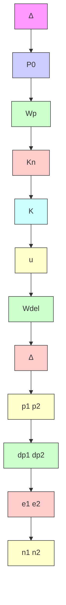
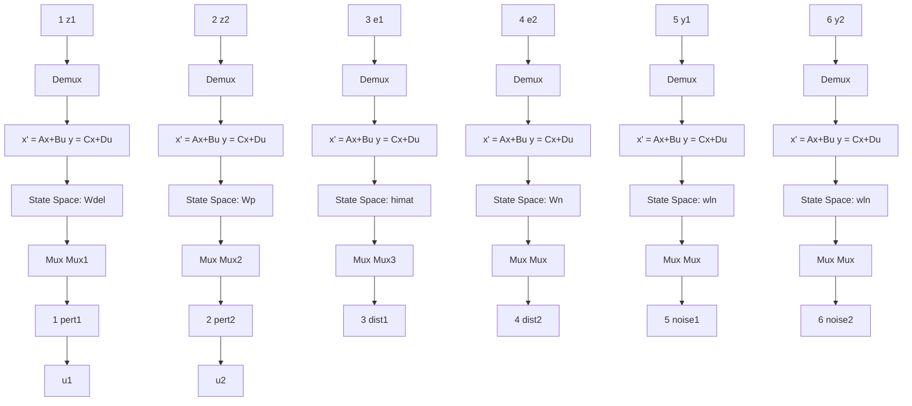

Figure 9.7: HIMAT closed-loop interconnection

The open-loop interconnection is

$$
\left[ \begin{array}{c} z _ {1} \\ z _ {2} \\ e _ {1} \\ e _ {2} \\ y _ {1} \\ y _ {2} \end{array} \right] = \hat {G} (s) \left[ \begin{array}{c} p _ {1} \\ p _ {2} \\ d _ {1} \\ d _ {2} \\ n _ {1} \\ n _ {2} \\ u _ {1} \\ u _ {2} \end{array} \right].
$$

The Simulink block diagram of this open-loop interconnection is shown in Figure 9.8.

aircraft.m   
File Edit Options Simulation Style   

flowchart

Figure 9.8: Simulink block diagram for HIMAT (aircraft.m)

The ${ \hat { G } } ( s ) = \left[ { \frac { A \mid B } { C \mid D } } \right]$ can be computed by

$$\gg [ \mathrm{A}, \mathrm{B}, \mathrm{C}, \mathrm{D} ] = \operatorname{linmod} \left(^ {\prime} \text { aircraft } ^ {\prime}\right)$$

which gives
