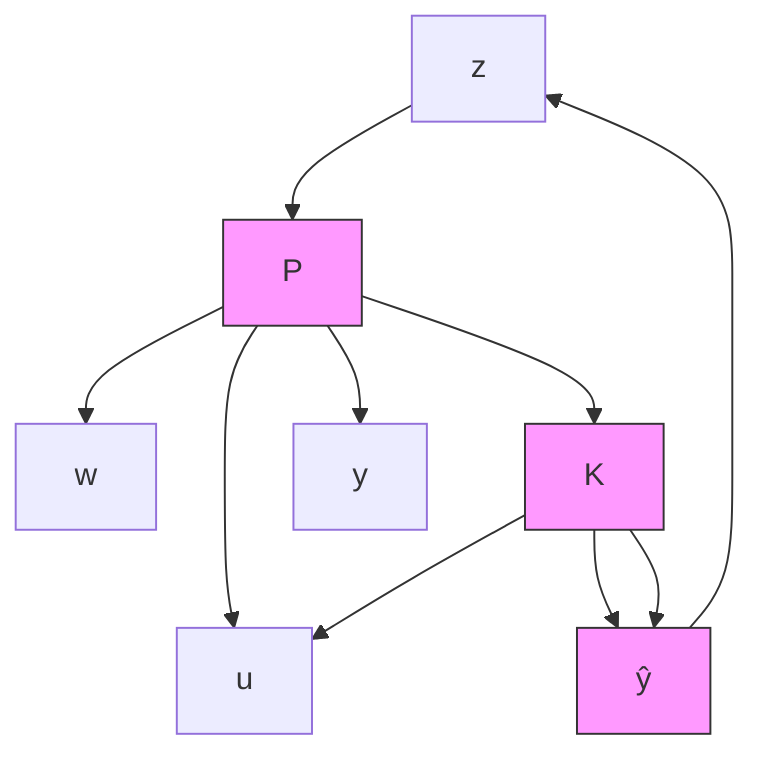

# 9.3 Redheffer Star Products

The most important property of LFTs is that any interconnection of LFTs is again an LFT. This property is by far the most often used and is the heart of LFT machinery. Indeed, it is not hard to see that most of the interconnection structures discussed earlier (e.g., feedback and cascade) can be viewed as special cases of the so-called star product.

Suppose that P and K are compatibly partitioned matrices

$$
P = \left[ \begin{array}{l l} P _ {1 1} & P _ {1 2} \\ P _ {2 1} & P _ {2 2} \end{array} \right], \quad K = \left[ \begin{array}{l l} K _ {1 1} & K _ {1 2} \\ K _ {2 1} & K _ {2 2} \end{array} \right]
$$

such that the matrix product $P _ { 2 2 } K _ { 1 1 }$ is well-defined and square, and assume further that $I - P _ { 2 2 } K _ { 1 1 }$ is invertible. Then the star product of P and K with respect to this partition is defined as

$$
P \star K := \left[ \begin{array}{c c} F _ {l} (P, K _ {1 1}) & P _ {1 2} (I - K _ {1 1} P _ {2 2}) ^ {- 1} K _ {1 2} \\ K _ {2 1} (I - P _ {2 2} K _ {1 1}) ^ {- 1} P _ {2 1} & F _ {u} (K, P _ {2 2}) \end{array} \right]. \tag {9.1}
$$

Note that this definition is dependent on the partitioning of the matrices P and K. In fact, this star product may be well-defined for one partition and not well-defined for another; however, we will not explicitly show this dependence because it is always clear from the context. In a block diagram, this dependence appears, as shown in Figure 9.9.

flowchart

  
Figure 9.9: Interconnection of $\mathrm { L F T s }$

Now suppose that P and K are transfer matrices with state-space representations:

$$
P = \left[ \begin{array}{c c c} A & B _ {1} & B _ {2} \\ \hline C _ {1} & D _ {1 1} & D _ {1 2} \\ C _ {2} & D _ {2 1} & D _ {2 2} \end{array} \right] \qquad K = \left[ \begin{array}{c c c} A _ {K} & B _ {K 1} & B _ {K 2} \\ \hline C _ {K 1} & D _ {K 1 1} & D _ {K 1 2} \\ C _ {K 2} & D _ {K 2 1} & D _ {K 2 2} \end{array} \right].
$$

Then the transfer matrix

$$
P \star K: \left[ \begin{array}{l} w \\ \hat {w} \end{array} \right] \mapsto \left[ \begin{array}{l} z \\ \hat {z} \end{array} \right]
$$

has a representation
