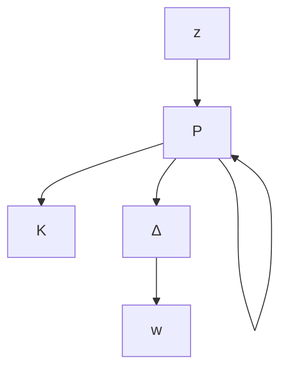

# 10.1 General Framework for System Robustness

As we illustrated in Chapter 9, any interconnected system may be rearranged to fit the general framework in Figure 10.1. Although the interconnection structure can become quite complicated for complex systems, many software packages, such as Simulink and µ Analysis and Synthesis Toolbox, are available that could be used to generate the interconnection structure from system components. Various modeling assumptions will be considered, and the impact of these assumptions on analysis and synthesis methods will be explored in this general framework.

flowchart

Figure 10.1: General framework

Note that uncertainty may be modeled in two ways, either as external inputs or as perturbations to the nominal model. The performance of a system is measured in terms of the behavior of the outputs or errors. The assumptions that characterize the uncertainty, performance, and nominal models determine the analysis techniques that must be used. The models are assumed to be FDLTI systems. The uncertain inputs are assumed to be either filtered white noise or weighted power or weighted ${ \mathcal { L } } _ { p }$ signals. Performance is measured as weighted output variances, or as power, or as weighted output ${ \mathcal { L } } _ { p }$ norms. The perturbations are assumed to be themselves FDLTI systems that are norm-bounded as input-output operators. Various combinations of these assumptions form the basis for all the standard linear system analysis tools.

Given that the nominal model is an FDLTI system, the interconnection system has the form

$$
P (s) = \left[ \begin{array}{l l l} P _ {1 1} (s) & P _ {1 2} (s) & P _ {1 3} (s) \\ P _ {2 1} (s) & P _ {2 2} (s) & P _ {2 3} (s) \\ P _ {3 1} (s) & P _ {3 2} (s) & P _ {3 3} (s) \end{array} \right]
$$

and the closed-loop system is an LFT on the perturbation and the controller given by

$$z = \mathcal {F} _ {u} (\mathcal {F} _ {\ell} (P, K), \Delta) w= \mathcal {F} _ {\ell} \left(\mathcal {F} _ {u} (P, \Delta), K\right) w.$$

We shall focus our discussion in this section on analysis methods; therefore, the controller may be viewed as just another system component and absorbed into the

interconnection structure. Denote
