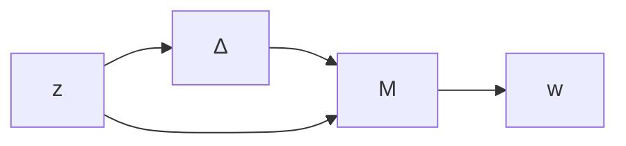
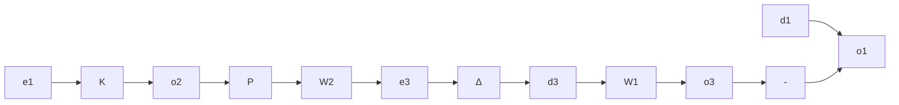

$$
M (s) = \mathcal {F} _ {\ell} \left(P (s), K (s)\right) = \left[ \begin{array}{c c} M _ {1 1} (s) & M _ {1 2} (s) \\ M _ {2 1} (s) & M _ {2 2} (s) \end{array} \right].
$$

Then the general framework reduces to Figure 10.2, where

$$z = \mathcal {F} _ {u} (M, \Delta) w = \left[ M _ {2 2} + M _ {2 1} \Delta (I - M _ {1 1} \Delta) ^ {- 1} M _ {1 2} \right] w.$$

flowchart

Figure 10.2: Analysis framework

Suppose $K ( s )$ is a stabilizing controller for the nominal plant P . Then $\begin{array} { r } { M ( s ) \in \mathcal { R } \mathcal { H } _ { \infty } . } \end{array}$ In general, the stability of $\mathcal { F } _ { u } ( M , \Delta )$ does not necessarily imply the internal stability of the closed-loop feedback system. However, they can be made equivalent with suitably chosen w and z. For example, consider again the multiplicatively perturbed system shown in Figure 10.3.

flowchart

Figure 10.3: Multiplicatively perturbed systems

Now let

$$
w := \left[ \begin{array}{c} d _ {1} \\ d _ {2} \end{array} \right], z := \left[ \begin{array}{c} e _ {1} \\ e _ {2} \end{array} \right].
$$

Then the system is robustly stable for all $\Delta ( s ) \in \mathcal { R H } _ { \infty }$ with $\| \Delta \| _ { \infty } < 1$ if and only if $\mathcal { F } _ { u } ( M , \Delta ) \in \mathcal { R } \mathcal { H } _ { \infty }$ for all admissible $\Delta$ with $M _ { 1 1 } = - W _ { 2 } P K ( I + \bar { P } K ) ^ { - 1 } W _ { 1 }$ , which is guaranteed by $\| M _ { 1 1 } \| _ { \infty } \leq 1$ .

∞The analysis results presented in the previous chapters together with the associated synthesis tools are summarized in Table 10.1 with various uncertainty modeling assumptions.
