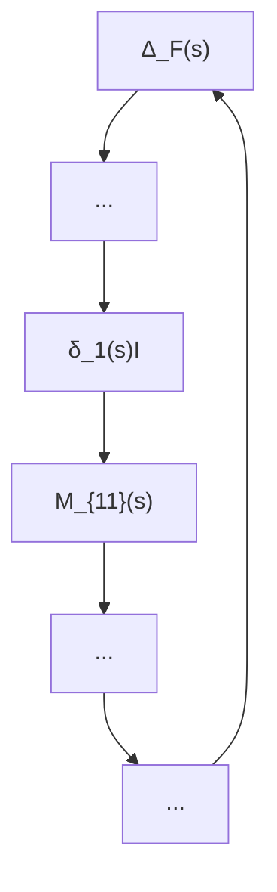

(1) $\| M _ { 1 1 } \| _ { \infty } \leq 1$ implies stability, but not conversely, because this test ignores the ∞known block diagonal structure of the uncertainties and is equivalent to regarding $\Delta$ as unstructured. This can be arbitrarily conservative in that stable systems can have arbitrarily large $\| M _ { 1 1 } \| _ { \infty }$ .

flowchart

Figure 10.4: Robust stability analysis framework

(2) Test for each $\delta _ { i } ~ ( \Delta _ { j } )$ individually (assuming no uncertainty in other channels). This test can be arbitrarily optimistic because it ignores interaction between the $\delta _ { i } ~ ( \Delta _ { j } )$ . This optimism is also clearly shown in the spinning body example in Section 8.6.

The difference between the stability margins (or bounds on $\Delta )$ obtained in (1) and (2) can be arbitrarily far apart. Only when the margins are close can conclusions be made about the general case with structured uncertainty.

The exact stability and performance analysis for systems with structured uncertainty requires a new matrix function called the structured singular value (SSV), which is denoted by µ.
