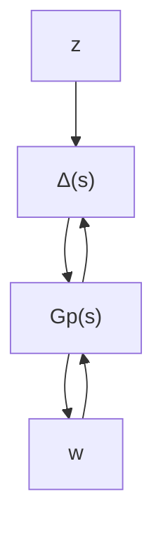

# 10.3.2 Robust Performance

Often, stability is not the only property of a closed-loop system that must be robust to perturbations. Typically, there are exogenous disturbances acting on the system (wind gusts, sensor noise) that result in tracking and regulation errors. Under perturbation, the effect that these disturbances have on error signals can greatly increase. In most cases, long before the onset of instability, the closed-loop performance will degrade to the point of unacceptability (hence the need for a “robust performance” test). Such a test will indicate the worst-case level of performance degradation associated with a given level of perturbations.

Assume $G _ { p }$ is a stable, real-rational, proper transfer function with $q _ { 1 } + q _ { 2 }$ inputs and $p _ { 1 } + p _ { 2 }$ outputs. Partition $G _ { p }$ in the obvious manner

$$
G _ {p} (s) = \left[ \begin{array}{l l} G _ {1 1} & G _ {1 2} \\ G _ {2 1} & G _ {2 2} \end{array} \right]
$$

so that $G _ { 1 1 }$ has $q _ { 1 }$ inputs and $p _ { 1 }$ outputs, and so on. Let $\pmb { \Delta } \subset \mathbb { C } ^ { q _ { 1 } \times p _ { 1 } }$ be a block structure, as in equation (10.1). Define an augmented block structure:

$$
\boldsymbol {\Delta} _ {P} := \left\{\left[ \begin{array}{c c} \Delta & 0 \\ 0 & \Delta_ {f} \end{array} \right]: \Delta \in \boldsymbol {\Delta}, \Delta_ {f} \in \mathbb {C} ^ {q _ {2} \times p _ {2}} \right\}.
$$

The setup is to address theoretically the robust performance questions about the following loop:

flowchart

The transfer function from w to z is denoted by $\mathcal { F } _ { u } \left( G _ { p } , \Delta \right)$ .

Theorem 10.8 Let $\beta > 0$ . For all $\Delta ( s ) \in \mathcal { M } ( \Delta )$ with $\begin{array} { r } { \| \Delta \| _ { \infty } < \frac { 1 } { \beta } } \end{array}$ , the loop shown above is well-posed, internally stable, and $\begin{array} { r } { \left\| \mathcal { F } _ { u } \left( G _ { p } , \Delta \right) \right\| _ { \infty } \leq \beta } \end{array}$ if and only if

$$\sup _ {\omega \in \mathbb {R}} \mu_ {\boldsymbol {\Delta} _ {P}} (G _ {p} (j \omega)) \leq \beta .$$
