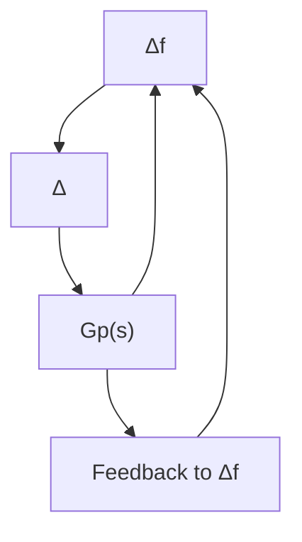

Note that by internal stability, $\operatorname { s u p } _ { \omega \in \mathbb { R } }$ $\mu _ { \Delta } ( G _ { 1 1 } ( j \omega ) ) \leq \beta _ { \Delta }$ , then the proof of this theorem is exactly along the lines of the earlier proof for Theorem 10.7, but also appeals to Theorem 10.6. This is a remarkably useful theorem. It says that a robust performance problem is equivalent to a robust stability problem with augmented uncertainty $\Delta ,$ as shown in Figure 10.5.

flowchart

Figure 10.5: Robust performance vs robust stability

Example 10.4 We shall consider again the HIMAT problem from Example 9.1. Use the Simulink block diagram in Example 9.1 and run the following commands to get an interconnection model ${ \hat { G } } ,$ an $\mathcal { H } _ { \infty }$ stabilizing controller K and a closed-loop transfer matrix $G _ { p } ( s ) = { \mathcal { F } } _ { \ell } ( { \hat { G } } , K )$ . (Do not bother to figure out how hinfsyn works; it will be considered in detail in Chapter 14.)

$\gg \ [ \mathbf { A } , \mathbf { B } , \mathbf { C } , \mathbf { D } ] = \mathbf { l i n m o d } ( ^ { \prime } \mathbf { a i r c r a f t ^ { \prime } } )$

$\gg \hat { \mathbf { G } } = \mathbf { p c k } ( \mathbf { A } , \mathbf { B } , \mathbf { C } , \mathbf { D } ) ;$

$\begin{array} { r } { \gg \vert \mathbf { K } , \mathbf { G } _ { \mathbf { p } } , \gamma \vert = \mathbf { h i n f s y n } ( \hat { \mathbf { G } } , \mathbf { 2 } , \mathbf { 2 } , \mathbf { 0 } , \mathbf { 1 0 } , \mathbf { 0 . 0 0 1 } , \mathbf { 2 } ) ; } \end{array}$

which gives $\gamma = 1 . 8 6 1 2 = \left\| \boldsymbol { G } _ { p } \right\| _ { \infty } ;$ , a stabilizing controller K, and a closed loop transfer matrix $G _ { p }$ :

$$
\left[ \begin{array}{c} z _ {1} \\ z _ {2} \\ e _ {1} \\ e _ {2} \end{array} \right] = G _ {p} (s) \left[ \begin{array}{c} p _ {1} \\ p _ {2} \\ d _ {1} \\ d _ {2} \\ n _ {1} \\ n _ {2} \end{array} \right], \quad G _ {p} (s) = \left[ \begin{array}{c c} G _ {p 1 1} & G _ {p 1 2} \\ G _ {p 2 1} & G _ {p 2 2} \end{array} \right].
$$

line

| frequency (rad/sec) | maximum singular value |
| --- | --- |
| 0.001 | 1.2 |
| 0.01 | 1.2 |
| 0.1 | 1.2 |
| 1 | 1.2 |
| 10 | 0.5 |
| 100 | 0.5 |
| 1000 | 0.5 |

Figure 10.6: Singular values of $G _ { p } ( j \omega )$
