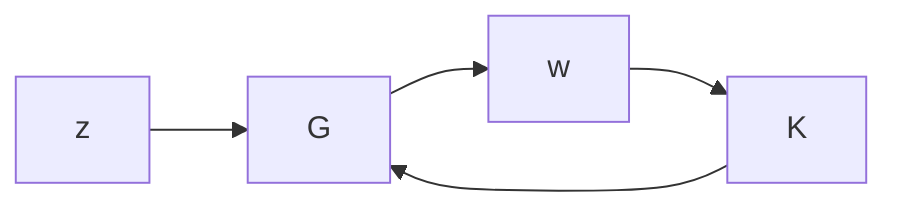

# 10.4 Overview of $\mu$ Synthesis

This section briefly outlines various synthesis methods. The details are somewhat complicated and are treated in the other parts of this book. At this point, we simply want to point out how the analysis theory discussed in the previous sections leads naturally to synthesis questions.

From the analysis results, we see that each case eventually leads to the evaluation of

$$\| M \| _ {\alpha} \quad \alpha = 2, \infty , \text { or } \mu \tag {10.31}$$

for some transfer matrix M . Thus when the controller is put back into the problem, it involves only a simple linear fractional transformation, as shown in Figure 10.8, with

$$M = \mathcal {F} _ {\ell} (G, K) = G _ {1 1} + G _ {1 2} K (I - G _ {2 2} K) ^ {- 1} G _ {2 1}$$

where $G = { \left[ \begin{array} { l l } { G _ { 1 1 } } & { G _ { 1 2 } } \\ { G _ { 2 1 } } & { G _ { 2 2 } } \end{array} \right] }$ is chosen, respectively, as

• nominal performance only $( \Delta = 0 ) \colon G = \left[ \begin{array} { l l } { P _ { 2 2 } } & { P _ { 2 3 } } \\ { P _ { 3 2 } } & { P _ { 3 3 } } \end{array} \right]$   
• robust stability only: $G = \left[ \begin{array} { l l } { P _ { 1 1 } } & { P _ { 1 3 } } \\ { P _ { 3 1 } } & { P _ { 3 3 } } \end{array} \right]$   
• robust performance: $G = P = { \left[ \begin{array} { l l } { P _ { 1 1 } } & { P _ { 1 2 } \vdots P _ { 1 3 } } \\ { P _ { 2 1 } } & { P _ { 2 2 } \vdots P _ { 2 3 } } \\ { - { \frac { P _ { 3 1 } } { P _ { 3 1 } } } } & { P _ { 3 2 } \vdots P _ { 3 3 } } \end{array} \right] }$

flowchart

Figure 10.8: Synthesis framework

Each case then leads to the synthesis problem

$$\min _ {K} \| \mathcal {F} _ {\ell} (G, K) \| _ {\alpha} \quad \text { for } \alpha = 2, \infty , \text { or } \mu , \tag {10.32}$$

which is subject to the internal stability of the nominal.

The solutions of these problems for $\alpha = 2$ and ∞ are the focus of the rest of this book. The $\alpha = 2$ case was already known in the 1960s, and the result presented in this book is simply a new interpretation. The two Riccati solutions for the $\alpha = \infty$ case were new products of the late 1980s.

The synthesis for the $\alpha = \mu$ case is not yet fully solved. Recall that µ may be obtained by scaling and applying $\left\| \cdot \right\| _ { \infty }$ (for $F \leq 3$ and $S = 0 )$ ; a reasonable approach is to “solve”
