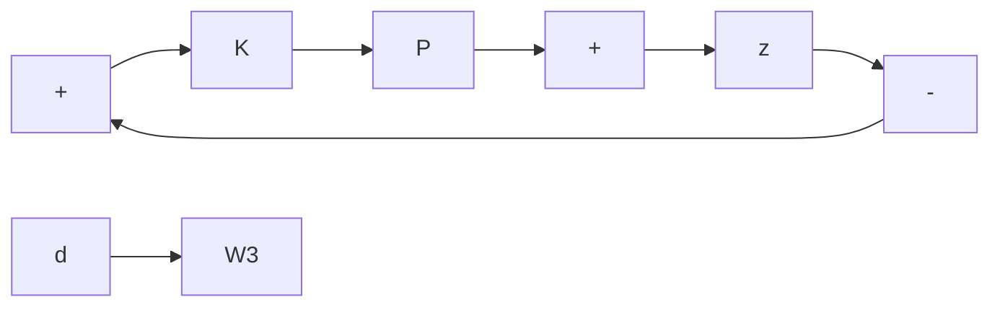

(a) Show that the feedback system is robustly stable if and only if K stabilizes $P _ { 0 }$ and

$$\left\| \left| W _ {1} T \right| + \left| W _ {2} K S \right| \right\| _ {\infty} \leq 1$$

where

$$S = \frac {1}{1 + P _ {0} K}, T = \frac {P _ {0} K}{1 + P _ {0} K}.$$

(b) Show that the feedback system has robust performance; that is, $\| T _ { z d } \| _ { \infty } \leq 1$ , if and only if K stabilizes $P _ { 0 }$ and

$$\left\| \left| W _ {3} S \right| + \left| W _ {1} T \right| + \left| W _ {2} K S \right| \right\| _ {\infty} \leq 1.$$

Problem 10.12 In Problem 10.11, find a matrix

$$
M = \left[ \begin{array}{l l} M _ {1 1} & M _ {1 2} \\ M _ {2 1} & M _ {2 2} \end{array} \right]
$$

such that

$$
z = \mathcal {F} _ {u} (M, \Delta) d, \Delta_ {s} = \left[ \begin{array}{c c} \Delta_ {1} & \\ & \Delta_ {2} \end{array} \right].
$$

Assume that K stabilizes $P _ { 0 }$ . Show that at each frequency

$$\mu_ {\Delta_ {s}} (M _ {1 1}) = \inf _ {D _ {s} \in \mathcal {D} _ {s}} \overline {{\sigma}} (D _ {s} M _ {1 1} D _ {s} ^ {- 1}) = | W _ {1} T | + | W _ {2} K S |$$

$D _ { s } = { \left[ \begin{array} { l l } { d } & { } \\ { } & { 1 } \end{array} \right] }$

$$
\text {Next let} \Delta = \left[ \begin{array}{c c} \Delta_ {s} & \\ & \Delta_ {p} \end{array} \right] \text {and} D = \left[ \begin{array}{c c c} d _ {1} & & \\ & d _ {2} & \\ & & 1 \end{array} \right]. \text {Show that}
\mu_ {\Delta} (M) = \inf _ {D \in \mathcal {D}} \overline {{\sigma}} (D M D ^ {- 1}) = | W _ {3} S | + | W _ {1} T | + | W _ {2} K S |
$$

Problem 10.13 Let $\Delta = \mathrm { d i a g } ( \Delta _ { 1 } , . . . , \Delta _ { F } )$ be a structured uncertainty and suppose $M = x y ^ { * }$ with $x , y \in \mathbb { C } ^ { n }$ . Let x and y be partitioned compatibly with the $\Delta { \mathrm { : } }$ :

$$
x = \left( \begin{array}{c} x _ {1} \\ x _ {2} \\ \vdots \\ x _ {m + F} \end{array} \right), \quad y = \left( \begin{array}{c} y _ {1} \\ y _ {2} \\ \vdots \\ y _ {m + F} \end{array} \right).
$$

Show that

$$\mu_ {\Delta} (M) = \inf _ {D \in \mathcal {D}} \overline {{\sigma}} (D M D ^ {- 1})$$

and the minimizing $d _ { i }$ are given by

$$d _ {i} ^ {2} = \frac {\| y _ {i} \| \| x _ {F} \|}{\| x _ {i} \| \| y _ {F} \|}.$$
