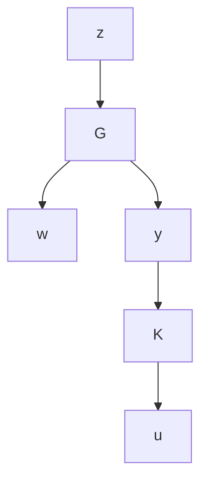

# Controller Parameterization

The basic configuration of the feedback systems considered in this chapter is an LFT , as shown in Figure 11.1, where G is the generalized plant with two sets of inputs: the exogenous inputs w, which include disturbances and commands, and control inputs u. The plant G also has two sets of outputs: the measured (or sensor) outputs y and the regulated outputs z. K is the controller to be designed. A control problem in this setup is either to analyze some specific properties (e.g., stability or performance) of the closed loop or to design the feedback control K such that the closed-loop system is stable in some appropriate sense and the error signal z is specified (i.e., some performance specifications are satisfied). In this chapter we are only concerned with the basic internal stabilization problems. We will see again that this setup is very convenient for other general control synthesis problems in the coming chapters.

flowchart

Figure 11.1: General system interconnection

Suppose that a given feedback system is feedback stabilizable. In this chapter, the problem we are mostly interested in is parameterizing all controllers that stabilize the system. The parameterization of all internally stabilizing controllers was first introduced by Youla et al. [1976a, 1976b] using the coprime factorization technique. We shall, however, focus on the state-space approach in this chapter.
