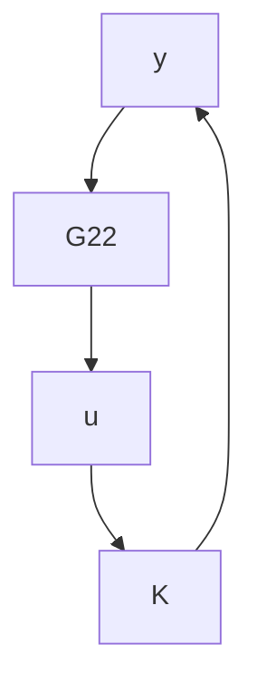

flowchart

Figure 11.2: Equivalent stabilization diagram

Lemma 11.2 Suppose the inherited realization $[ { \frac { A \ } { C _ { 2 } \ } } | { \frac { B _ { 2 } \ } { D _ { 2 2 } \ } } ]$ for $G _ { 2 2 }$ is stabilizable and detectable. Then the system in Figure 11.1 is internally stable $i f f$ the one in Figure 11.2 is internally stable.

In other words, $K ( s )$ internally stabilizes $G ( s )$ if and only if it internally stabilizes $G _ { 2 2 }$ [provided that $( A , B _ { 2 } , C _ { 2 } )$ is stabilizable and detectable].

Proof. The necessity follows from the definition. To show the sufficiency, it is sufficient to show that the system in Figure 11.1 and that in Figure 11.2 share the same A matrix, which is obvious. ✷

From Lemma 11.2, we see that the stabilizing controller for G depends only on $G _ { 2 2 }$ . Hence all stabilizing controllers for G can be obtained by using only $G _ { 2 2 }$ .

Remark 11.1 There should be no confusion between a given realization for a transfer matrix $G _ { 2 2 }$ and the inherited realization from $G ,$ where $G _ { 2 2 }$ is a submatrix. A given realization for $G _ { 2 2 }$ may be stabilizable and detectable while the inherited realization may not be. For instance,

$$
G _ {2 2} = \frac {1}{s + 1} = \left[ \begin{array}{c c} - 1 & 1 \\ \hline 1 & 0 \end{array} \right]
$$

is a minimal realization but the inherited realization of $G _ { 2 2 }$ from

$$
\left[ \begin{array}{c c} G _ {1 1} & G _ {1 2} \\ G _ {2 1} & G _ {2 2} \end{array} \right] = \left[ \begin{array}{c c c c} - 1 & 0 & 0 & 1 \\ 0 & 1 & 1 & 0 \\ \hline 0 & 1 & 0 & 0 \\ 1 & 0 & 0 & 0 \end{array} \right]
$$

is

$$
G _ {2 2} = \left[ \begin{array}{c c c} - 1 & 0 & 1 \\ 0 & 1 & 0 \\ \hline 1 & 0 & 0 \end{array} \right] \quad \left(= \frac {1}{s + 1}\right),
$$

which is neither stabilizable nor detectable.

