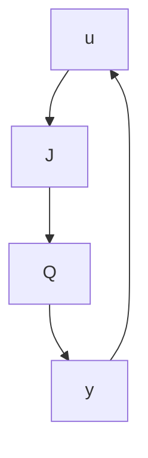

flowchart

$$
J = \left[ \begin{array}{c c c} A + B _ {2} F + L C _ {2} + L D _ {2 2} F & - L & B _ {2} + L D _ {2 2} \\ \hline F & 0 & I \\ - (C _ {2} + D _ {2 2} F) & I & - D _ {2 2} \end{array} \right]
$$

with any $Q \in \mathcal { R } \mathcal { H } _ { \infty }$ and $I + D _ { 2 2 } Q ( \infty )$ nonsingular. Furthermore, the set of all closedloop transfer matrices from w to z achievable by an internally stabilizing proper controller is equal to

$$\mathcal {F} _ {\ell} (T, Q) = \{T _ {1 1} + T _ {1 2} Q T _ {2 1}: Q \in \mathcal {R H} _ {\infty}, I + D _ {2 2} Q (\infty) \text {invertible} \}$$

where T is given by

$$
T = \left[ \begin{array}{c c} T _ {1 1} & T _ {1 2} \\ T _ {2 1} & T _ {2 2} \end{array} \right] = \left[ \begin{array}{c c c c} A + B _ {2} F & - B _ {2} F & B _ {1} & B _ {2} \\ 0 & A + L C _ {2} & B _ {1} + L D _ {2 1} & 0 \\ \hline C _ {1} + D _ {1 2} F & - D _ {1 2} F & D _ {1 1} & D _ {1 2} \\ 0 & C _ {2} & D _ {2 1} & 0 \end{array} \right].
$$

Proof. Let $K = \mathcal { F } _ { \ell } ( J , Q )$ . Then it is straightforward to verify, by using the statespace star product formula and some tedious algebra, that $\mathcal { F } _ { \ell } ( G , K ) = T _ { 1 1 } + T _ { 1 2 } Q T _ { 2 1 }$ with the T given in the theorem. Hence the controller $K = \mathcal { F } _ { \ell } ( J , Q )$ for any given $Q \in \mathcal { R } \mathcal { H } _ { \infty }$ does internally stabilize $G .$ Now let K be any stabilizing controller for $G ;$ then $\mathcal { F } _ { \ell } ( \hat { J } , K ) \in \mathcal { R } \mathcal { H } _ { \infty }$ , where

$$
\hat {J} = \left[ \begin{array}{c c c} A & - L & B _ {2} \\ \hline - F & 0 & I \\ C _ {2} & I & D _ {2 2} \end{array} \right].
$$

(Jˆ is stabilized by K since it has the same $G _ { 2 2 }$ matrix as $G . )$

Let $Q _ { 0 } : = \mathcal { F } _ { \ell } ( \hat { J } , K ) \in \mathcal { R } \mathcal { H } _ { \infty } ;$ then $\mathcal { F } _ { \ell } ( J , Q _ { 0 } ) = \mathcal { F } _ { \ell } ( J , \mathcal { F } _ { \ell } ( \hat { J } , K ) ) = : \mathcal { F } _ { \ell } ( J _ { t m p } , K )$ , where $J _ { t m p }$ can be obtained by using the state-space star product formula given in Chapter 9:

$$
\begin{array}{r l r} {J _ {t m p}} & = & {\left[ \begin{array}{c c c c} A + L C _ {2} + B _ {2} F + L D _ {2 2} F & - (B _ {2} + L D _ {2 2}) F & - L & B _ {2} + L D _ {2 2} \\ L (C _ {2} + D _ {2 2} F) & A - L D _ {2 2} F & - L & B _ {2} + L D _ {2 2} \\ \hline F & - F & 0 & I \\ - (C _ {2} + D _ {2 2} F) & C _ {2} + D _ {2 2} F & I & 0 \end{array} \right]} \end{array}
