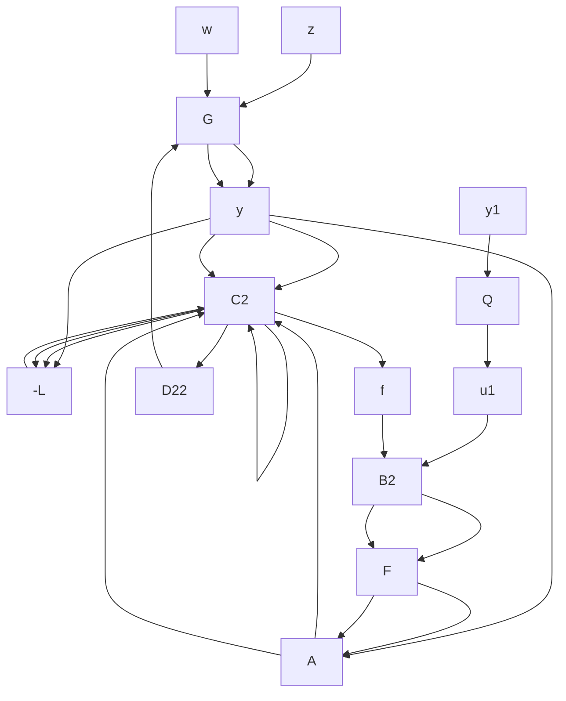

\begin{array}{l} = \left[ \begin{array}{c c c c} A + L C _ {2} & - (B _ {2} + L D _ {2 2}) F & - L & B _ {2} + L D _ {2 2} \\ 0 & A + B _ {2} F & 0 & 0 \\ \hline 0 & - F & 0 & I \\ 0 & C _ {2} & I & 0 \end{array} \right] \\ = \left[ \begin{array}{c c} 0 & I \\ I & 0 \end{array} \right]. \\ \end{array}
$$

Hence $\mathcal { F } _ { \ell } ( J , Q _ { 0 } ) = \mathcal { F } _ { \ell } ( J _ { t m p } , K ) = K$ . This shows that any stabilizing controller can be expressed in the form of $\mathcal { F } _ { \ell } ( J , Q _ { 0 } )$ for some $Q _ { 0 } \in \mathcal { R } \mathcal { H } _ { \infty }$ . ✷

An important point to note is that the closed-loop transfer matrix is simply an affine function of the controller parameter matrix Q. The proper K’s achieving internal stability are precisely those represented in Figure 11.3.

flowchart

Figure 11.3: Structure of stabilizing controllers

It is interesting to note that the system in the dashed box is an observer-based stabilizing controller for $G$ (or $G _ { 2 2 } )$ . Furthermore, it is easy to show that the transfer function between $( y , u _ { 1 } )$ and $( u , y _ { 1 } )$ is $J ;$ that is,

$$
\left[ \begin{array}{c} u \\ y _ {1} \end{array} \right] = J \left[ \begin{array}{c} y \\ u _ {1} \end{array} \right].
$$

It is also easy to show that the transfer matrix from $u _ { 1 }$ to $y _ { 1 }$ is $T _ { 2 2 } = 0$ .

This diagram of the parameterization of all stabilizing controllers also suggests an interesting interpretation: Every internal stabilization amounts to adding stable dynamics to the plant and then stabilizing the extended plant by means of an observer. The precise statement is as follows: For simplicity of the formulas, only the cases of strictly proper $G _ { 2 2 }$ and K are treated.

Theorem 11.5 Assume that $G _ { 2 2 }$ and K are strictly proper and the system in Figure 11.1 is internally stable. Then $G _ { 2 2 }$ can be embedded in a system

$$
\left[ \begin{array}{c c} A _ {e} & B _ {e} \\ \hline C _ {e} & 0 \end{array} \right]
$$

where

$$
A _ {e} = \left[ \begin{array}{c c} A & 0 \\ 0 & A _ {a} \end{array} \right], B _ {e} = \left[ \begin{array}{c} B _ {2} \\ 0 \end{array} \right], C _ {e} = \left[ \begin{array}{c c} C _ {2} & 0 \end{array} \right] \tag {11.3}
$$
