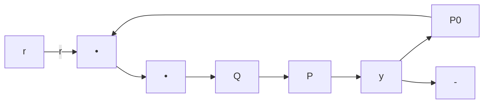
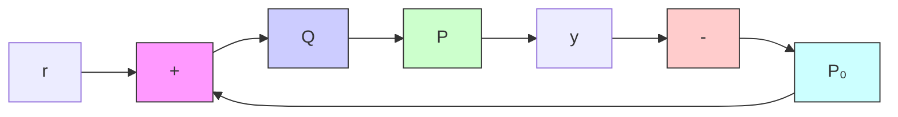

# 11.5 Problems

Problem 11.1 Let $P = \frac { 1 } { s - 1 }$ Find the set of all stabilizing controllers $K = \mathcal { F } _ { \ell } ( J , Q )$ . Now verify that $K _ { 0 } = - \check { 4 }$ is a stabilizing controller and find a $Q _ { 0 } \in \mathcal { R } \mathcal { H } _ { \infty }$ such that $K _ { 0 } = \mathcal { F } _ { \ell } ( J , Q _ { 0 } )$ .

Problem 11.2 Suppose that $\{ P _ { i } : ~ i = 1 , \ldots , n \}$ is a set of MIMO plants and that there is a single controller K that internally stabilizes each $P _ { i }$ in the set. Show that there exists a single transfer function P such that the set

$$\mathcal {P} = \{\mathcal {F} _ {u} (P, \Delta) | \Delta \in \mathcal {H} _ {\infty}, \| \Delta \| _ {\infty} \leq 1 \}$$

is also robustly stabilized by K and that $\{ P _ { i } \} \subset \mathcal { P }$ .

Problem 11.3 Internal Model Control (IMC): Suppose a plant P is stable. Then it is known that all stabilizing controllers can be parameterized as $K ( s ) = Q ( I - P Q ) ^ { - 1 }$ for all stable Q. In practice, the exact plant model is not known, only a nominal model $P _ { 0 }$ is available. Hence the controller can be implemented as in the following diagram:

flowchart

The control diagram can be redrawn as follows:

flowchart

This control implementation is known as internal model control (IMC). Note that no signal is fed back if the model is exact. Discuss the advantage of this implementation and possible generalizations.

Problem 11.4 Use the Youla parameterization (the coprime factor form) to show that a SISO plant cannot be stabilized by a stable controller if the plant does not satisfy the parity interlacing properties. [A SISO plant is said to satisfy the parity interlacing property if the number of unstable real poles between any two unstable real zeros is even; +∞ counts as a unstable zero if the plant is strictly proper. See Youla, Jabr, and Lu [1974] and Vidyasagar [1985].]
