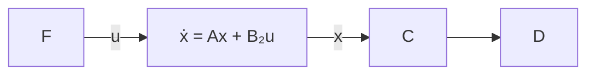

# 13.4 Guaranteed Stability Margins of LQR

Now we will consider the system described by equation (13.6) with the LQR control law $u = F x$ . The closed-loop block diagram is as shown in Figure 13.1.

The following result is the key to stability margins of an LQR control law.

Lemma 13.4 Let $F = - ( B _ { 2 } ^ { * } X + D _ { 1 2 } ^ { * } C _ { 1 } )$ and define $G _ { 1 2 } = D _ { 1 2 } + C _ { 1 } ( s I - A ) ^ { - 1 } B _ { 2 }$ . Then

$$\left(I - B _ {2} ^ {*} (- s I - A ^ {*}) ^ {- 1} F ^ {*}\right) \left(I - F (s I - A) ^ {- 1} B _ {2}\right) = G _ {1 2} ^ {\sim} (s) G _ {1 2} (s).$$

flowchart

Figure 13.1: LQR closed-loop system

Proof. Note that the Riccati equation (13.9) can be written as

$$X A + A ^ {*} X - F ^ {*} F + C _ {1} ^ {*} C _ {1} = 0.$$

Add and subtract sX to the above equation to get

$$- X (s I - A) - (- s I - A ^ {*}) X - F ^ {*} F + C _ {1} ^ {*} C _ {1} = 0.$$

Now multiply the above equation from the left by $B _ { 2 } ^ { * } ( - s I - A ^ { * } ) ^ { - 1 }$ and from the right by $( s I - A ) ^ { - 1 } B _ { 2 }$ to get

$$
\begin{array}{l} - B _ {2} ^ {*} (- s I - A ^ {*}) ^ {- 1} X B _ {2} - B _ {2} ^ {*} X (s I - A) ^ {- 1} B _ {2} - B _ {2} ^ {*} (- s I - A ^ {*}) ^ {- 1} F ^ {*} F (s I - A) ^ {- 1} B _ {2} \\ + B _ {2} ^ {*} (- s I - A ^ {*}) ^ {- 1} C _ {1} ^ {*} C _ {1} (s I - A) ^ {- 1} B _ {2} = 0. \\ \end{array}
$$

Using $- B _ { 2 } ^ { * } X = F + D _ { 1 2 } ^ { * } C _ { 1 }$ in the above equation, we have

$$
\begin{array}{l} B _ {2} ^ {*} (- s I - A ^ {*}) ^ {- 1} F ^ {*} + F (s I - A) ^ {- 1} B _ {2} - B _ {2} ^ {*} (- s I - A ^ {*}) ^ {- 1} F ^ {*} F (s I - A) ^ {- 1} B _ {2} \\ + B _ {2} ^ {*} (- s I - A ^ {*}) ^ {- 1} C _ {1} ^ {*} D _ {1 2} + D _ {1 2} ^ {*} C _ {1} (s I - A) ^ {- 1} B _ {2} \\ + B _ {2} ^ {*} (- s I - A ^ {*}) ^ {- 1} C _ {1} ^ {*} C _ {1} (s I - A) ^ {- 1} B _ {2} = 0. \\ \end{array}
$$

Then the result follows from completing the square and from the fact that ${ \cal D } _ { 1 2 } ^ { * } { \cal D } _ { 1 2 } = I .$

✷

Corollary 13.5 Suppose $D _ { 1 2 } ^ { * } C _ { 1 } = 0$ . Then

$$\left(I - B _ {2} ^ {*} (- s I - A ^ {*}) ^ {- 1} F ^ {*}\right) \left(I - F (s I - A) ^ {- 1} B _ {2}\right) = I + B _ {2} ^ {*} (- s I - A ^ {*}) ^ {- 1} C _ {1} ^ {*} C _ {1} (s I - A) ^ {- 1} B _ {2}.$$

In particular,

$$\left(I - B _ {2} ^ {*} (- j \omega I - A ^ {*}) ^ {- 1} F ^ {*}\right) \left(I - F (j \omega I - A) ^ {- 1} B _ {2}\right) \geq I \tag {13.14}$$

and

$$\left(I + B _ {2} ^ {*} (- j \omega I - A ^ {*} - F ^ {*} B _ {2} ^ {*}) ^ {- 1} F ^ {*}\right) \left(I + F (j \omega I - A - B _ {2} F) ^ {- 1} B _ {2}\right) \leq I. \tag {13.15}$$
