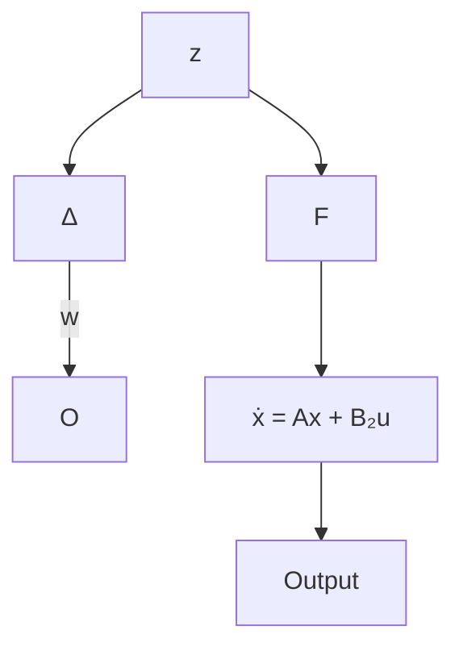

Note that the inequality (13.15) follows from taking the inverse of inequality (13.14).

Define $G ( s ) = - F ( s I - A ) ^ { - 1 } B _ { 2 }$ and assume for the moment that the system is single-input. Then the inequality (13.14) shows that the open-loop Nyquist diagram of the system $G ( s )$ in Figure 13.1 never enters the unit disk centered at $( - 1 , 0 )$ of the complex plane. Hence the system has at least a 6 dB $\left( = 2 0 \log 2 \right)$ gain margin and a $6 0 ^ { \mathrm { o } }$ phase margin in both directions. A similar interpretation may be generalized to multiple-input systems.

Next, it is noted that the inequality (13.15) can also be given some robustness interpretation. In fact, it implies that the closed-loop system in Figure 13.1 is stable even if the open-loop system $G ( s )$ is perturbed additively by $\mathrm { ~ a ~ } \Delta \in \mathcal { R } \mathcal { H } _ { \infty }$ as long as $\| \Delta \| _ { \infty } < 1$ . This can be seen from the following block diagram and the small gain theorem, where the transfer matrix from w to z is exactly $I + F ( j \omega I - A - B _ { 2 } F ) ^ { - 1 } B _ { 2 }$ .

flowchart

