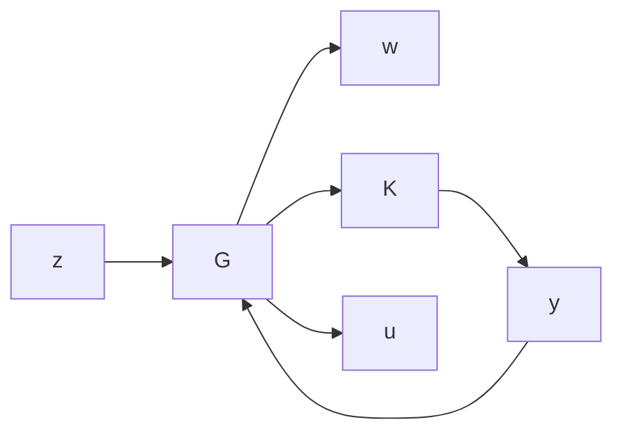

# 13.5 Standard $\mathcal { H } _ { 2 }$ Problem

The system considered in this section is described by the following standard block diagram:

flowchart

The realization of the transfer matrix G is taken to be of the form

$$
G (s) = \left[ \begin{array}{c c c} A & B _ {1} & B _ {2} \\ \hline C _ {1} & 0 & D _ {1 2} \\ C _ {2} & D _ {2 1} & 0 \end{array} \right].
$$

Notice the special off-diagonal structure of D: $D _ { 2 2 }$ is assumed to be zero so that $G _ { 2 2 }$ is strictly $\mathrm { p r o p e r } ; { 1 }$ also, $D _ { 1 1 }$ is assumed to be zero in order to guarantee that the $\mathcal { H } _ { 2 }$

problem is properly posed.2

The following additional assumptions are made for the output feedback $\mathcal { H } _ { 2 }$ problem in this chapter:

(i) $( A , B _ { 2 } )$ is stabilizable and $( C _ { 2 } , A )$ is detectable;   
(ii) $R _ { 1 } = D _ { 1 2 } ^ { * } D _ { 1 2 } > 0$ and $R _ { 2 } = D _ { 2 1 } D _ { 2 1 } ^ { * } > 0 ;$   
(iii) $\left[ \begin{array} { c c } { A - j \omega I } & { B _ { 2 } } \\ { C _ { 1 } } & { D _ { 1 2 } } \end{array} \right]$ has full column rank for all $\omega ;$   
(iv) $\left[ \begin{array} { c c } { A - j \omega I } & { B _ { 1 } } \\ { C _ { 2 } } & { D _ { 2 1 } } \end{array} \right]$ has full row rank for all $\omega .$

The first assumption is for the stabilizability of G by output feedback, and the third and the fourth assumptions together with the first guarantee that the two Hamiltonian matrices associated with the following $\mathcal { H } _ { 2 }$ problem belong to dom(Ric). The assumptions in (ii) guarantee that the $\mathcal { H } _ { 2 }$ optimal control problem is nonsingular.

$\mathcal { H } _ { 2 }$ Problem The $\mathcal { H } _ { 2 }$ control problem is to find a proper, real rational controller K that stabilizes G internally and minimizes the $\mathcal { H } _ { 2 }$ norm of the transfer matrix $T _ { z w }$ from w $t o \ z$ .

In the following discussions we shall assume that we have state models of $G$ and $K .$ Recall that a controller is said to be admissible if it is internally stabilizing and proper. By Corollary 12.7 the two Hamiltonian matrices

$$
H _ {2} := \left[ \begin{array}{c c} A - B _ {2} R _ {1} ^ {- 1} D _ {1 2} ^ {*} C _ {1} & - B _ {2} R _ {1} ^ {- 1} B _ {2} ^ {*} \\ - C _ {1} ^ {*} (I - D _ {1 2} R _ {1} ^ {- 1} D _ {1 2} ^ {*}) C _ {1} & - (A - B _ {2} R _ {1} ^ {- 1} D _ {1 2} ^ {*} C _ {1}) ^ {*} \end{array} \right]
