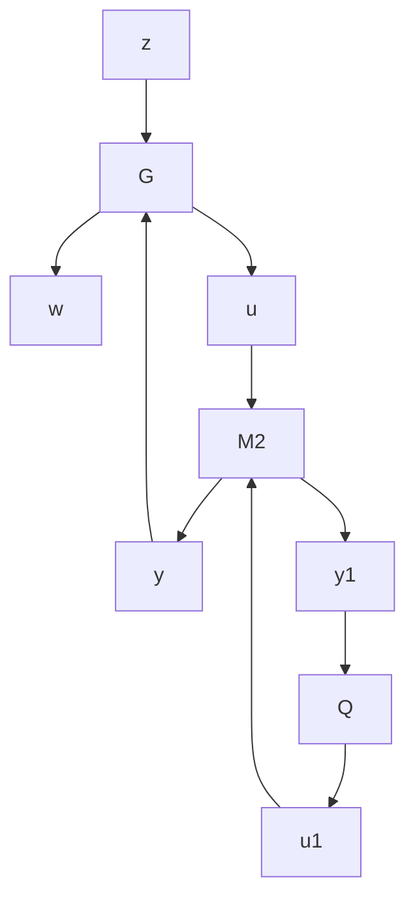

$$A _ {F _ {2}} ^ {*} X _ {2} + X _ {2} A _ {F _ {2}} + C _ {1 F _ {2}} ^ {*} C _ {1 F _ {2}} = 0.$$

We get

$$
U ^ {\sim} U = \left[ \begin{array}{c c c} - A _ {F _ {2}} ^ {*} & 0 & 0 \\ 0 & A _ {F _ {2}} & B _ {2} R _ {1} ^ {- 1 / 2} \\ \hline R _ {1} ^ {- 1 / 2} B _ {2} ^ {*} & 0 & I \end{array} \right] = I

U ^ {\sim} G _ {c} = \left[ \begin{array}{c c c} - A _ {F _ {2}} ^ {*} & 0 & - X _ {2} \\ 0 & A _ {F _ {2}} & I \\ \hline R _ {1} ^ {- 1 / 2} B _ {2} ^ {*} & 0 & 0 \end{array} \right] = \left[ \begin{array}{c c} - A _ {F _ {2}} ^ {*} & - X _ {2} \\ \hline R _ {1} ^ {- 1 / 2} B _ {2} ^ {*} & 0 \end{array} \right] \in \mathcal {R H} _ {2} ^ {\perp}.
$$

It follows by duality that $G _ { f } V ^ { \sim } \in \mathcal { R } \mathcal { H } _ { 2 } ^ { \bot }$ and V is a co-inner.

✷

Theorem 13.7 There exists a unique optimal controller

$$
K _ {\mathrm{opt}} (s) := \left[ \begin{array}{c c} \hat {A} _ {2} & - L _ {2} \\ \hline F _ {2} & 0 \end{array} \right].
$$

Moreover,

$$\min \left\| T _ {z w} \right\| _ {2} ^ {2} = \left\| G _ {c} B _ {1} \right\| _ {2} ^ {2} + \left\| R _ {1} ^ {1 / 2} F _ {2} G _ {f} \right\| _ {2} ^ {2} = \operatorname{trace} \left(B _ {1} ^ {*} X _ {2} B _ {1}\right) + \operatorname{trace} \left(R _ {1} F _ {2} Y _ {2} F _ {2} ^ {*}\right).$$

Proof. Consider the all-stabilizing controller parameterization $K ( s ) = \mathcal { F } _ { \ell } ( M _ { 2 } , Q )$ $Q \in \mathcal { R } \mathcal { H } _ { \infty }$ with

$$
M _ {2} (s) = \left[ \begin{array}{c c c} \hat {A} _ {2} & - L _ {2} & B _ {2} \\ \hline F _ {2} & 0 & I \\ - C _ {2} & I & 0 \end{array} \right]
$$

and consider the following system diagram:

flowchart

Then $T _ { z w } = \mathcal { F } _ { \ell } ( N , Q )$ with

$$
N = \left[ \begin{array}{c c c c} A _ {F _ {2}} & - B _ {2} F _ {2} & B _ {1} & B _ {2} \\ 0 & A _ {L _ {2}} & B _ {1 L _ {2}} & 0 \\ \hline C _ {1 F _ {2}} & - D _ {1 2} F _ {2} & 0 & D _ {1 2} \\ 0 & C _ {2} & D _ {2 1} & 0 \end{array} \right]
$$

and

$$T _ {z w} = G _ {c} B _ {1} - U R _ {1} ^ {1 / 2} F _ {2} G _ {f} + U R _ {1} ^ {1 / 2} Q R _ {2} ^ {1 / 2} V.$$

It follows from Lemma 13.6 that $G _ { c } B _ { 1 }$ and U are orthogonal. Thus

$$
\begin{array}{l} {\| T _ {z w} \| _ {2} ^ {2}} = {\| G _ {c} B _ {1} \| _ {2} ^ {2} + \left\| U R _ {1} ^ {1 / 2} F _ {2} G _ {f} - U R _ {1} ^ {1 / 2} Q R _ {2} ^ {1 / 2} V \right\| _ {2} ^ {2}} \\ = \| G _ {c} B _ {1} \| _ {2} ^ {2} + \left\| R _ {1} ^ {1 / 2} F _ {2} G _ {f} - R _ {1} ^ {1 / 2} Q R _ {2} ^ {1 / 2} V \right\| _ {2} ^ {2}. \\ \end{array}
$$
