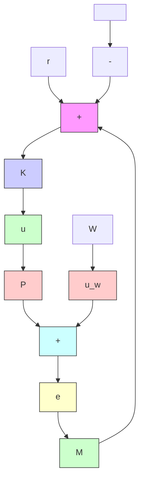

# 13.8 Problems

Problem 13.1 Let v(t) ∈ L2[0, ∞). Let y(t) be the output of the system G(s) = 1s+1 $v ( t ) \in L _ { 2 } [ 0 , \infty )$ $y ( t )$ $\textstyle G ( s ) = { \frac { 1 } { s + 1 } }$ with input v. Prove that $\begin{array} { r } { \operatorname* { l i m } _ { t \to \infty } y ( t ) = 0 } \end{array}$ .

Problem 13.2 Parameterize all stabilizing controllers satisfying $\| T _ { z w } \| _ { 2 } \leq \gamma$ for a given $\gamma > 0$ .

Problem 13.3 Consider the feedback system in Figure 6.3 and suppose

$$P = \frac {s - 1 0}{(s + 1) (s + 1 0)}, W _ {e} = \frac {1}{s + 0 . 0 0 1}, W _ {u} = \frac {s + 2}{s + 1 0}.$$

Design a controller that minimizes

$$
\left\| \left[ \begin{array}{c} W _ {e} S _ {o} \\ W _ {u} K S _ {o} \end{array} \right] \right\| _ {2}.
$$

Simulate the time response of the system when r is a step.

Problem 13.4 Repeat Problem 13.3 when $W _ { e } = 1 / s$ . (Note that the solution given in this chapter cannot be applied directly.)

Problem 13.5 Consider the model matching (or reference) control problem shown here:

flowchart

Let $M ( s ) \in \mathcal { H } _ { \infty }$ be a strictly proper transfer matrix and $W ( s ) , W ^ { - 1 } ( s ) \in \mathcal { R } \mathcal { H } _ { \infty }$ . Formulate an $\mathcal { H } _ { 2 }$ control problem that minimizes $u _ { w }$ and the error e through minimizing the $\mathcal { H } _ { 2 }$ norm of the transfer matrix from $r$ to $( e , u _ { w } )$ . Apply your formula to

$$M (s) = \frac {4}{s ^ {2} + 2 s + 4}, P (s) = \frac {1 0 (s + 2)}{(s + 1) ^ {3}}, W (s) = \frac {0 . 1 (s + 1)}{s + 1 0}.$$

Problem 13.6 Repeat Problem 13.5 with $W = \epsilon$ for $\epsilon = 0 . 0 1$ and 0.0001. Study the behavior of the controller when $\epsilon  0$ .

Problem 13.7 Repeat Problem 13.5 and Problem 13.6 with

$$P = \frac {1 0 (2 - s)}{(s + 1) ^ {3}}.$$
