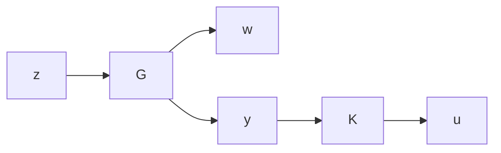

# 14.1 Problem Formulation

Consider the system described by the block diagram

flowchart

where the plant G and controller K are assumed to be real rational and proper. It will be assumed that state-space models of G and K are available and that their realizations are assumed to be stabilizable and detectable. Recall again that a controller is said to be admissible if it internally stabilizes the system. Clearly, stability is the most basic requirement for a practical system to work. Hence any sensible controller has to be admissible.

Optimal $\mathcal { H } _ { \infty }$ Control: Find all admissible controllers $K ( s )$ such that $\| T _ { z w } \| _ { \infty }$ is minimized.

It should be noted that the optimal $\mathcal { H } _ { \infty }$ controllers as just defined are generally not unique for MIMO systems. Furthermore, finding an optimal $\mathcal { H } _ { \infty }$ controller is often both numerically and theoretically complicated, as shown in Glover and Doyle [1989]. This is certainly in contrast with the standard $\mathcal { H } _ { 2 }$ theory, in which the optimal controller is unique and can be obtained by solving two Riccati equations without iterations. Knowing the achievable optimal (minimum) $\mathcal { H } _ { \infty }$ norm may be useful theoretically since it sets a limit on what we can achieve. However, in practice it is often not necessary and sometimes even undesirable to design an optimal controller, and it is usually much cheaper to obtain controllers that are very close in the norm sense to the optimal ones, which will be called suboptimal controllers. A suboptimal controller may also have other nice properties (e.g., lower bandwidth) over the optimal ones.

Suboptimal $\mathcal { H } _ { \infty }$ Control: Given $\gamma > 0$ , find all admissible controllers $K ( s )$ , if there are any, such that $\| T _ { z w } \| _ { \infty } < \gamma$ .

For the reasons mentioned above, we focus our attention in this book on suboptimal control. When appropriate, we briefly discuss what will happen when $\gamma$ approaches the optimal value.
