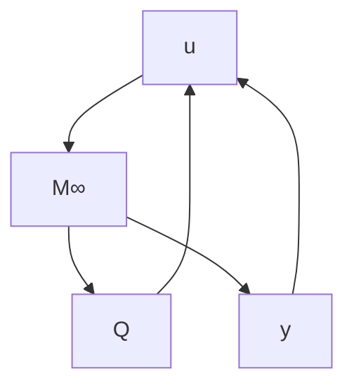

Theorem 14.1 There exists an admissible controller such that $\| T _ { z w } \| _ { \infty } < \gamma$ iff the following three conditions hold:

(i) $H _ { \infty } \in \mathrm { d o m } ( \mathrm { R i c } )$ and $X _ { \infty } : = \operatorname { R i c } ( H _ { \infty } ) > 0 ;$ ;

(ii) $J _ { \infty } \in \mathrm { d o m } ( \mathrm { R i c } )$ and $Y _ { \infty } : = \operatorname { R i c } ( J _ { \infty } ) > 0 ;$ ;

(iii) $\rho ( X _ { \infty } Y _ { \infty } ) < \gamma ^ { 2 }$ .

Moreover, when these conditions hold, one such controller is

$$
K _ {\mathrm{sub}} (s) := \left[ \begin{array}{c c} \hat {A} _ {\infty} & - Z _ {\infty} L _ {\infty} \\ \hline F _ {\infty} & 0 \end{array} \right]
$$

where

$$\hat {A} _ {\infty} := A + \gamma^ {- 2} B _ {1} B _ {1} ^ {*} X _ {\infty} + B _ {2} F _ {\infty} + Z _ {\infty} L _ {\infty} C _ {2}F _ {\infty} := - B _ {2} ^ {*} X _ {\infty}, \quad L _ {\infty} := - Y _ {\infty} C _ {2} ^ {*}, \quad Z _ {\infty} := (I - \gamma^ {- 2} Y _ {\infty} X _ {\infty}) ^ {- 1}.$$

Furthermore, the set of all admissible controllers such that $\| T _ { z w } \| _ { \infty } < \gamma$ equals the set of all transfer matrices from y to u in

flowchart

$$
M _ {\infty} (s) = \left[ \begin{array}{c c c} \hat {A} _ {\infty} & - Z _ {\infty} L _ {\infty} & Z _ {\infty} B _ {2} \\ \hline F _ {\infty} & 0 & I \\ - C _ {2} & I & 0 \end{array} \right]
$$

where $Q \in \mathcal { R H } _ { \infty } , \| Q \| _ { \infty } < \gamma$

We shall only give a proof of the first part of the theorem; the proof for the allcontroller parameterization needs much more work and is omitted (see Zhou, Doyle, and Glover [1996] for a comprehensive treatment of the related topics). We shall first show some preliminary results.

Lemma 14.2 Suppose that $X \in \mathbb { R } ^ { n \times n } , Y \in \mathbb { R } ^ { n \times n }$ , with $X = X ^ { * } > 0$ , and $Y = Y ^ { * } > 0$ . Let r be a positive integer. Then there exist matrices $X _ { 1 2 } \in \mathbb { R } ^ { n \times r } , X _ { 2 } \in \mathbb { R } ^ { r \times r }$ such that $X _ { 2 } = X _ { 2 } ^ { * }$

$$
\left[ \begin{array}{c c} X & X _ {1 2} \\ X _ {1 2} ^ {*} & X _ {2} \end{array} \right] > 0 \quad \text {and} \quad \left[ \begin{array}{c c} X & X _ {1 2} \\ X _ {1 2} ^ {*} & X _ {2} \end{array} \right] ^ {- 1} = \left[ \begin{array}{c c} Y & \star \\ \star & \star \end{array} \right]
$$

if and only if
