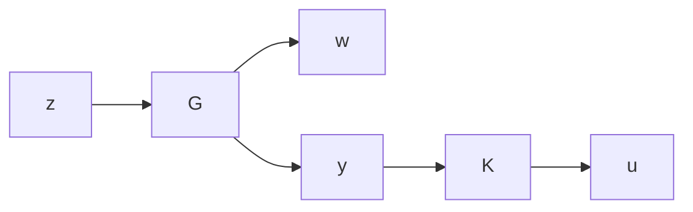

# 14.6 General $\mathcal { H } _ { \infty }$ Solutions

Consider the system described by the block diagram

flowchart

where, as usual, G and K are assumed to be real rational and proper with K constrained to provide internal stability. The controller is said to be admissible if it is real rational, proper, and stabilizing. Although we are taking everything to be real, the results presented here are still true for the complex case with some obvious modifications. We will again only be interested in characterizing all suboptimal $\mathcal { H } _ { \infty }$ controllers.

The realization of the transfer matrix G is taken to be of the form

$$
G (s) = \left[ \begin{array}{c c c} A & B _ {1} & B _ {2} \\ \hline C _ {1} & D _ {1 1} & D _ {1 2} \\ C _ {2} & D _ {2 1} & 0 \end{array} \right] = \left[ \begin{array}{c c} A & B \\ \hline C & D \end{array} \right],
$$

which is compatible with the dimensions of $z ( t ) \in \mathbb { R } ^ { p _ { 1 } } , \ y ( t ) \ \in \ \mathbb { R } ^ { p _ { 2 } } , \ w ( t ) \ \in \ \mathbb { R } ^ { m _ { 1 } }$ , $u ( t ) \in \mathbb { R } ^ { m _ { 2 } }$ , and the state $\ b { x } ( t ) \in \mathbb { R } ^ { n }$ . The following assumptions are made:

(A1) $( A , B _ { 2 } )$ is stabilizable and $( C _ { 2 } , A )$ is detectable;

$( \mathrm { A 2 } ) \ D _ { 1 2 } = { \left[ \begin{array} { l } { 0 } \\ { I } \end{array} \right] } { \mathrm { ~ a n d ~ } } D _ { 2 1 } = { \left[ \begin{array} { l l } { 0 } & { I } \end{array} \right] } ;$   
(A3) $\left[ \begin{array} { c c } { A - j \omega I } & { B _ { 2 } } \\ { C _ { 1 } } & { D _ { 1 2 } } \end{array} \right]$ has full column rank for all ω;   
$( \mathrm { A } 4 ) \left[ { \begin{array} { r r } { A - j \omega I } & { B _ { 1 } } \\ { C _ { 2 } } & { D _ { 2 1 } } \end{array} } \right] \mathrm { h a s ~ f u l l ~ r o w ~ r a n k ~ f o r ~ a l l ~ } \omega .$
