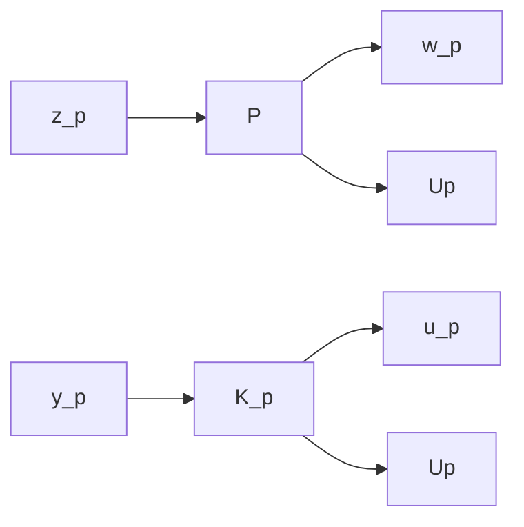

# 14.7 Relaxing Assumptions

In this section, we indicate how the results of Section 14.6 can be extended to more general cases. Let a given problem have the following diagram, where $z _ { p } ( t ) \in \mathbb { R } ^ { p _ { 1 } }$ , $y _ { p } ( t ) \in \mathbb { R } ^ { p _ { 2 } } , w _ { p } ( t ) \in \mathbb { R } ^ { m _ { 1 } }$ , and $u _ { p } ( t ) \in \mathbb { R } ^ { m _ { 2 } }$ :

flowchart

The plant P has the following state-space realization with $D _ { p 1 2 }$ full column rank and $D _ { p 2 1 }$ full row rank:

$$
P (s) = \left[ \begin{array}{c c c} A _ {p} & B _ {p 1} & B _ {p 2} \\ \hline C _ {p 1} & D _ {p 1 1} & D _ {p 1 2} \\ C _ {p 2} & D _ {p 2 1} & D _ {p 2 2} \end{array} \right].
$$

The objective is to find all rational proper controllers $K _ { p } ( s )$ that stabilize P and $| | \mathcal { F } _ { \ell } ( P , K _ { p } ) | | _ { \infty } < \gamma$ . To solve this problem, we first transform it to the standard one treated in the last section. Note that the following procedure can also be applied to the $\mathcal { H } _ { 2 }$ problem (except the procedure for the case $D _ { 1 1 } \neq 0 )$ .
