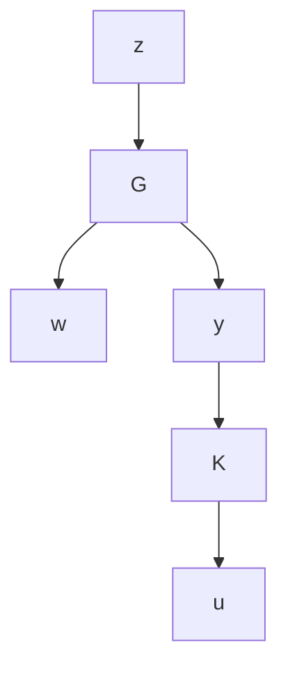

# Normalize $D _ { 1 2 }$ and $D _ { 2 1 }$

Perform singular value decompositions to obtain the matrix factorizations

$$
D _ {p 1 2} = U _ {p} \left[ \begin{array}{l} 0 \\ I \end{array} \right] R _ {p}, \quad D _ {p 2 1} = \tilde {R} _ {p} \left[ \begin{array}{l l} 0 & I \end{array} \right] \tilde {U} _ {p}
$$

such that $U _ { p }$ and $\tilde { U } _ { p }$ are square and unitary and $R _ { p }$ and ${ \tilde { R } } _ { p }$ are square and invertible. Now let

$$z _ {p} = U _ {p} z, w _ {p} = \tilde {U} _ {p} ^ {*} w, y _ {p} = \tilde {R} _ {p} y, u _ {p} = R _ {p} ^ {- 1} u$$

and

$$
K (s) = R _ {p} K _ {p} (s) \tilde {R} _ {p}
G (s) = \left[ \begin{array}{c c} U _ {p} ^ {*} & 0 \\ 0 & \tilde {R} _ {p} ^ {- 1} \end{array} \right] P (s) \left[ \begin{array}{c c} \tilde {U} _ {p} ^ {*} & 0 \\ 0 & R _ {p} ^ {- 1} \end{array} \right]

= \left[ \begin{array}{c c c} A _ {p} & B _ {p 1} \tilde {U} _ {p} ^ {*} & B _ {p 2} R _ {p} ^ {- 1} \\ \hline U _ {p} ^ {*} C _ {p 1} & U _ {p} ^ {*} D _ {p 1 1} \tilde {U} _ {p} ^ {*} & U _ {p} ^ {*} D _ {p 1 2} R _ {p} ^ {- 1} \\ \tilde {R} _ {p} ^ {- 1} C _ {p 2} & \tilde {R} _ {p} ^ {- 1} D _ {p 2 1} \tilde {U} _ {p} ^ {*} & \tilde {R} _ {p} ^ {- 1} D _ {p 2 2} R _ {p} ^ {- 1} \end{array} \right]

=: \quad \left[ \begin{array}{c c c} A & B _ {1} & B _ {2} \\ \hline C _ {1} & D _ {1 1} & D _ {1 2} \\ C _ {2} & D _ {2 1} & D _ {2 2} \end{array} \right] = \left[ \begin{array}{c c} A & B \\ \hline C & D \end{array} \right].
$$

Then

$$
D _ {1 2} = \left[ \begin{array}{l} 0 \\ I \end{array} \right] \quad D _ {2 1} = \left[ \begin{array}{l l} 0 & I \end{array} \right],
$$

and the new system is as follows:

flowchart

Furthermore, $| | \mathcal { F } _ { \ell } ( P , K _ { p } ) | | _ { \alpha } = | | U _ { p } \mathcal { F } _ { \ell } ( G , K ) \tilde { U } _ { p } | | _ { \alpha } = | | \mathcal { F } _ { \ell } ( G , K ) | | _ { \alpha }$ for $\alpha = 2$ or ∞ since $U _ { p }$ and $\tilde { U } _ { p }$ are unitary. Moreover, Assumptions (A1), (A3), and (A4) remain unaffected.
