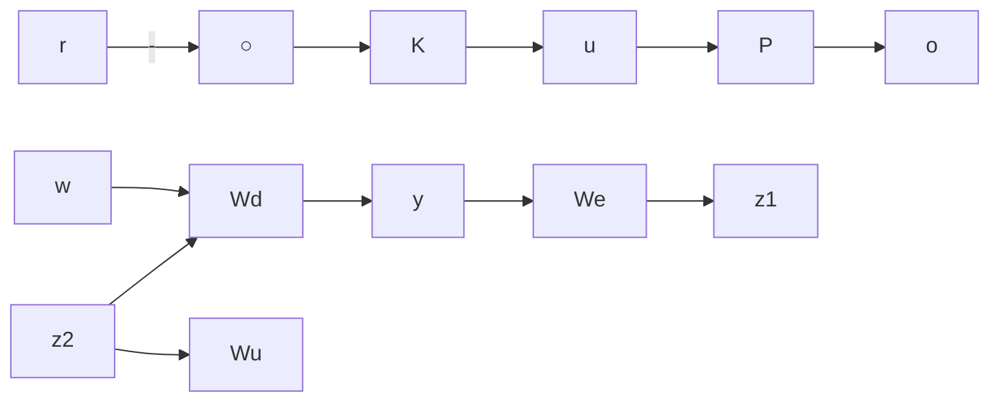

# 14.8 $\mathcal { H } _ { 2 }$ and $\mathcal { H } _ { \infty }$ Integral Control

It is interesting to note that the $\mathcal { H } _ { 2 }$ and $\mathcal { H } _ { \infty }$ design frameworks do not, in general, produce integral control. In this section we show how to introduce integral control into the $\mathcal { H } _ { 2 }$ and $\mathcal { H } _ { \infty }$ design framework through a simple disturbance rejection problem. We consider a feedback system shown in Figure 14.5. We shall assume that the frequency contents of the disturbance w are effectively modeled by the weighting $W _ { d } \in \mathcal { R } \mathcal { H } _ { \infty }$ and the constraints on control signal are limited by an appropriate choice of $W _ { u } \in \mathcal { R } \mathcal { H } _ { \infty } .$ In order to let the output y track the reference signal r, we require K to contain an integrator [i.e., K(s) has a pole at $s = 0 ]$ . (In general, K is required to have poles on the imaginary axis.)

There are several ways to achieve the integral design. One approach is to introduce an integral in the performance weight $W _ { e }$ . Then the transfer function between w and $z _ { 1 }$ is given by

$$z _ {1} = W _ {e} (I + P K) ^ {- 1} W _ {d} w.$$

Now if the resulting controller K stabilizes the plant P and makes the norm (2-norm or ∞-norm) between w and $z _ { 1 }$ finite, then K must have a pole at $s = 0$ that is the zero of the sensitivity function (assuming $W _ { d }$ has no zeros at $s = 0 )$ . (This follows from the well-known internal model principle.) The problem with this approach is that the $\mathcal { H } _ { \infty }$ (or H2) control theory presented in this chapter and in the previous chapters cannot be applied to this problem formulation directly because the pole $s = 0$ of $W _ { e }$ becomes an uncontrollable pole of the feedback system and the very first assumption for the $\mathcal { H } _ { \infty }$ (or $\mathcal { H } _ { 2 } )$ theory is violated.

flowchart

Figure 14.5: A simple disturbance rejection problem

However, the obstacles can be overcome by appropriately reformulating the problem. Suppose $W _ { e }$ can be factorized as follows:

$$W _ {e} = \tilde {W} _ {e} (s) M (s)$$
