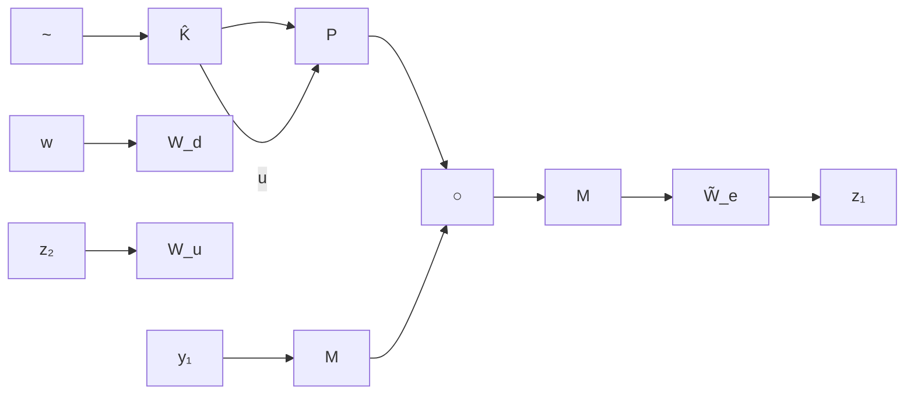

where $M ( s )$ is proper, containing all the imaginary axis poles of $W _ { e } ,$ , and $M ^ { - 1 } ( s ) \in \bar { \mathcal { R } } \mathcal { H } _ { \infty } , \ \tilde { W } _ { e } ( s )$ is stable and minimum phase. Now suppose there exists a controller $K ( s )$ that contains the same imaginary axis poles that achieves the performance specifications. Then, without loss of generality, K can be factorized as

$$K (s) = - \hat {K} (s) M (s)$$

such that there is no unstable pole/zero cancellation in forming the product $\hat { K } ( s ) M ( s )$ . Now the problem can be reformulated as in Figure 14.6. Figure 14.6 can be put in the general LFT framework as in Figure 14.7 with

$$
G (s) = \left[ \begin{array}{c c} \left[ \begin{array}{c} \tilde {W} _ {e} M W _ {d} \\ 0 \end{array} \right] & \left[ \begin{array}{c} \tilde {W} _ {e} M P \\ W _ {u} \end{array} \right] \\ M W _ {d} & M P \end{array} \right].
$$

We shall illustrate this design through a simple numerical example. Let

$$
P = \frac {s - 2}{(s + 1) (s - 3)} = \left[ \begin{array}{c c c} 0 & 1 & 0 \\ 3 & 2 & 1 \\ \hline - 2 & 1 & 0 \end{array} \right], W _ {d} = 1,

W _ {u} = \frac {s + 1 0}{s + 1 0 0} = \left[ \begin{array}{c c} - 1 0 0 & - 9 0 \\ \hline 1 & 1 \end{array} \right], \quad W _ {e} = \frac {1}{s}.
$$


<details>
<summary>flowchart</summary>


</details>

Figure 14.6: Disturbance rejection with imaginary axis poles   


<details>
<summary>flowchart</summary>

```mermaid
graph TD
    A["z1"] --> B["W̃e"]
    C["z2"] --> D["Wu"]
    B --> E["M"]
    D --> E
    E --> F["P"]
    F --> G["u"]
    H["w"] --> I["Wd"]
    J["y1"] --> K["K̂"]
    K --> F
    style A fill:#f9f,stroke:#333
    style C fill:#f9f,stroke:#333
    style H fill:#ccf,stroke:#333
    style J fill:#ccf,stroke:#333
    style B fill:#cff,stroke:#333
    style D fill:#cff,stroke:#333
    style E fill:#ffc,stroke:#333
    style F fill:#ffc,stroke:#333
    style G fill:#cfc,stroke:#333
    style K̂ fill:#fcc,stroke:#333
```
</details>

Figure 14.7: LFT framework for the disturbance rejection problem

Then we can choose without loss of generality that

$$M = \frac {s + \alpha}{s}, \tilde {W} _ {e} = \frac {1}{s + \alpha}, \alpha > 0.$$
