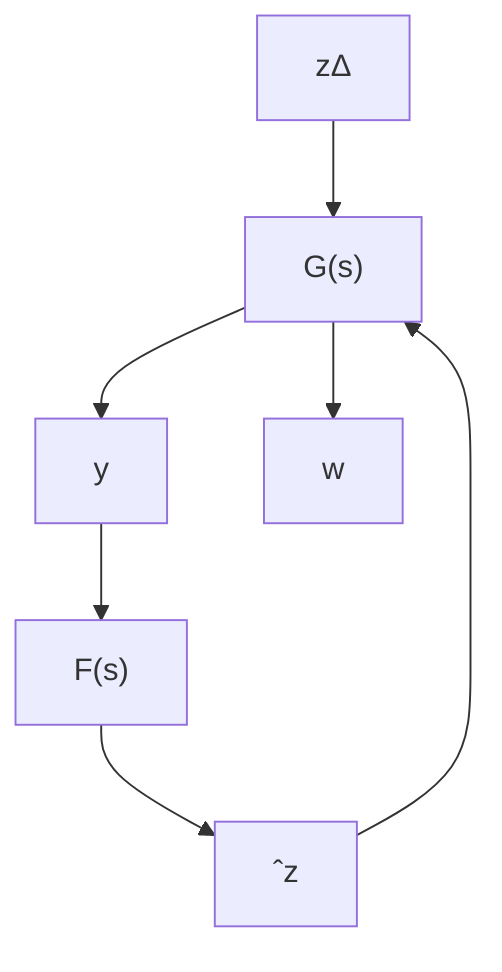

# 14.9 $\mathcal { H } _ { \infty }$ Filtering

In this section we show how the filtering problem can be solved using the $\mathcal { H } _ { \infty }$ theory developed earlier. Suppose a dynamic system is described by the following equations:

$$\dot {x} = A x + B _ {1} w (t), \quad x (0) = 0 \tag {14.18}y = C _ {2} x + D _ {2 1} w (t) \tag {14.19}z = C _ {1} x + D _ {1 1} w (t) \tag {14.20}$$

The filtering problem is to find an estimate ˆz of z in some sense using the measurement of $y .$ The restriction on the filtering problem is that the filter has to be causal so that it can be realized $( \mathrm { i . e . , ~ } \hat { z }$ has to be generated by a causal system acting on the measurements). We will further restrict our filter to be unbiased; that is, given $T > 0$ the estimate ${ \hat { z } } ( t ) = 0 \ \forall t \in [ 0 , T ] { \mathrm { ~ i f ~ } } y ( t ) = 0 , \ \forall t \in [ 0 , T ]$ . Now we can state our $\mathcal { H } _ { \infty }$ filtering problem.

$\mathcal { H } _ { \infty }$ Filtering: Given ${ \mathrm { ~ a ~ } } \gamma > 0 ,$ , find a causal filter $F ( s ) \in \mathcal { R } \mathcal { H } _ { \infty }$ if it exists

such that

$$J := \sup _ {w \in \mathcal {L} _ {2} [ 0, \infty)} \frac {\| z - \hat {z} \| _ {2} ^ {2}}{\| w \| _ {2} ^ {2}} < \gamma^ {2}$$

with ${ \hat { z } } = F ( s ) y$ .

A diagram for the filtering problem is shown in Figure 14.8.


<details>
<summary>flowchart</summary>

```mermaid
graph LR
    A["z"] --> B["+"]
    B --> C["F(s)"]
    C --> D["y"]
    D --> E["[A | B1 / C1 D11 / C2 D21"]]
    E --> F["w"]
    G["zΔ"] --> B
    H["-"] --> B
```
</details>

Figure 14.8: Filtering problem formulation

The preceding filtering problem can also be formulated in an LFT framework: Given a system shown below


<details>
<summary>flowchart</summary>


</details>

$$
G (s) = \left[ \begin{array}{c c c} A & B _ {1} & 0 \\ \hline C _ {1} & D _ {1 1} & - I \\ C _ {2} & D _ {2 1} & 0 \end{array} \right]
$$

find a filter $F ( s ) \in \mathcal { R } \mathcal { H } _ { \infty }$ such that

$$\sup _ {w \in \mathcal {L} _ {2}} \frac {\left\| z _ {\Delta} \right\| _ {2} ^ {2}}{\left\| w \right\| _ {2} ^ {2}} < \gamma^ {2}. \tag {14.21}$$
