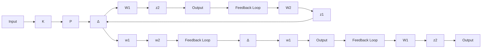

Suppose the true system is described by

$$P = (N + \Delta_ {N}) (M + \Delta_ {M}) ^ {- 1}$$

where $P _ { o } = N M ^ { - 1 }$ is a normalized coprime factorization. Design a controller so that the controller stabilizes the largest

$$
\Delta = \left[ \begin{array}{c} \Delta_ {N} \\ \Delta_ {M} \end{array} \right].
$$

Problem 14.11 Consider the feedback system shown below and let

$$P = \frac {0 . 5 (1 - s)}{(s + 2) (s + 0 . 5)}, \quad W _ {1} = 5 0 \frac {s / 1 . 2 4 5 + 1}{s / 0 . 0 0 7 + 1}, \quad W _ {2} = 0. 1 2 5 6 \frac {s / 0 . 5 0 2 + 1}{s / 2 + 1}.$$

flowchart

Figure 14.10: System with additive uncertainty

Then

$$
\left[ \begin{array}{c} z _ {1} \\ z _ {2} \end{array} \right] = \left[ \begin{array}{c c} - W _ {2} K S & - W _ {2} K S \\ W _ {1} S & W _ {1} S \end{array} \right] \left[ \begin{array}{c} w _ {1} \\ w _ {2} \end{array} \right] = M \left[ \begin{array}{c} w _ {1} \\ w _ {2} \end{array} \right]
$$

where $S = ( I + P K ) ^ { - 1 }$ .

(a) Design a controller K such that

$$\inf _ {K \text { stabilizing }} \| M \| _ {\infty}.$$

(b) Design a controller K so that

$$
\inf _ {K \text {stabilizing}} \sup _ {\omega} \mu_ {\Delta} (M), \qquad \Delta = \left[ \begin{array}{c c} \Delta_ {1} & \\ & \Delta_ {2} \end{array} \right].
$$

Note that $\mu _ { \Delta } ( M ) = | W _ { 1 } S | + | W _ { 2 } K S |$ .

Problem 14.12 Design a µ-synthesis controller for the HIMAT control problem in Example 9.1.

Problem 14.13 Let $G ( s ) \in \mathcal { H } _ { \infty }$ be a square transfer matrix and $\alpha > 0 .$ . Show that G is (extended) strictly positive real $( { \mathrm { i . e . , ~ } } G ^ { * } ( j \omega ) + G ( j \omega ) > 0 , ~ \forall ~ \omega \in \mathbb { R } \cup \{ \infty \} )$ if and only i $\mathrm { ~ f ~ } \left\| ( \alpha I - G ) ( \alpha I + G ) ^ { - 1 } \right\| _ { \infty } < 1$ .

Problem 14.14 Consider a generalized system

$$
G (s) = \left[ \begin{array}{c c c} A & B _ {1} & B _ {2} \\ \hline C _ {1} & D _ {1 1} & D _ {1 2} \\ C _ {2} & D _ {2 1} & D _ {2 2} \end{array} \right]
$$
