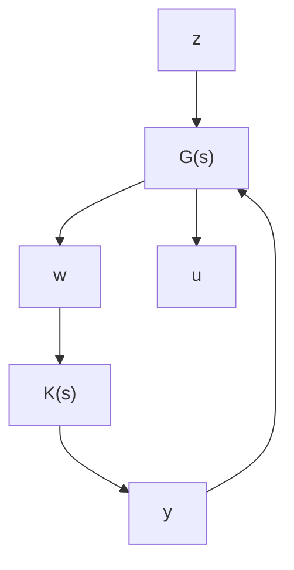

# 15.1 $\mathcal { H } _ { \infty }$ Controller Reductions

In this section, we consider an $\mathcal { H } _ { \infty }$ performance-preserving controller order reduction problem. We consider the feedback system shown in Figure 15.1 with a generalized plant realization given by

$$
G (s) = \left[ \begin{array}{c c c} A & B _ {1} & B _ {2} \\ \hline C _ {1} & D _ {1 1} & D _ {1 2} \\ C _ {2} & D _ {2 1} & D _ {2 2} \end{array} \right].
$$

flowchart

Figure 15.1: Closed-loop system diagram

The following assumptions are made:

(A1) $( A , B _ { 2 } )$ is stabilizable and $( C _ { 2 } , A )$ is detectable;   
(A2) $D _ { 1 2 }$ has full column rank and $D _ { 2 1 }$ has full row rank;

(A3) $\left[ \begin{array} { c c } { A - j \omega I } & { B _ { 2 } } \\ { C _ { 1 } } & { D _ { 1 2 } } \end{array} \right]$ has full column rank for all $\omega ;$

(A4) $\left[ \begin{array} { c c } { A - j \omega I } & { B _ { 1 } } \\ { C _ { 2 } } & { D _ { 2 1 } } \end{array} \right]$ has full row rank for all ω.

As stated in Chapter 14, all stabilizing controllers satisfying $\| T _ { z w } \| _ { \infty } < \gamma$ can be parameterized as

$$K = \mathcal {F} _ {\ell} (M _ {\infty}, Q), \quad Q \in \mathcal {R H} _ {\infty}, \quad \| Q \| _ {\infty} < \gamma \tag {15.1}$$

where $M _ { \infty }$ is of the form

$$
M _ {\infty} = \left[ \begin{array}{l l} M _ {1 1} (s) & M _ {1 2} (s) \\ M _ {2 1} (s) & M _ {2 2} (s) \end{array} \right] = \left[ \begin{array}{c c c} \hat {A} & \hat {B} _ {1} & \hat {B} _ {2} \\ \hline \hat {C} _ {1} & \hat {D} _ {1 1} & \hat {D} _ {1 2} \\ \hat {C} _ {2} & \hat {D} _ {2 1} & \hat {D} _ {2 2} \end{array} \right]
$$

such that $\hat { D } _ { 1 2 }$ and $\hat { D } _ { 2 1 }$ are invertible and $\hat { A } - \hat { B } _ { 2 } \hat { D } _ { 1 2 } ^ { - 1 } \hat { C } _ { 1 }$ and $\hat { A } - \hat { B } _ { 1 } \hat { D } _ { 2 1 } ^ { - 1 } \hat { C } _ { 2 }$ are both stable $( \mathrm { i . e . , } M _ { 1 2 } ^ { - 1 }$ and $M _ { 2 1 } ^ { - 1 }$ are both stable).
