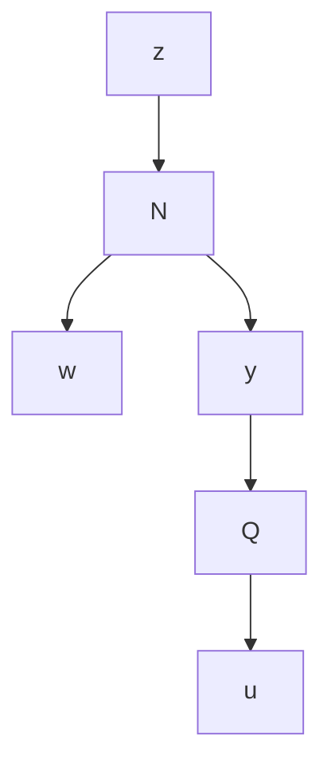

The problem to be considered here is to find a controller $\hat { K }$ with a minimal possible order such that the $\mathcal { H } _ { \infty }$ performance requirement $\left\| \mathcal { F } _ { \ell } ( G , \hat { K } ) \right\| _ { \infty } < \gamma$ is satisfied. This is clearly equivalent to finding a Q so that it satisfies the preceding constraint and the order of $\hat { K }$ is minimized. Instead of choosing Q directly, we shall approach this problem from a different perspective. The following lemma is useful in the subsequent development and can be regarded as a special case of Theorem 10.6 (main loop theorem).

Lemma 15.1 Consider a feedback system shown below

flowchart

where N is a suitably partitioned transfer matrix

$$
N (s) = \left[ \begin{array}{c c} N _ {1 1} & N _ {1 2} \\ N _ {2 1} & N _ {2 2} \end{array} \right].
$$

Then the closed-loop transfer matrix from w to z is given by

$$T _ {z w} = \mathcal {F} _ {\ell} (N, Q) = N _ {1 1} + N _ {1 2} Q (I - N _ {2 2} Q) ^ {- 1} N _ {2 1}.$$

Assume that the feedback loop is well-posed $/ i . e .$ , det $( I - N _ { 2 2 } ( \infty ) Q ( \infty ) ) \neq 0 ]$ and either $N _ { 2 1 } ( j \omega )$ has full row rank for all $\omega \in \mathbb { R } \cup$ ∞ or $N _ { 1 2 } ( j \omega )$ has full column rank for all $\omega \in \mathbb { R } \cup \infty$ and $\begin{array} { r } { \| N \| _ { \infty } \leq 1 , } \end{array}$ then $\| \mathcal { F } _ { \ell } ( N , Q ) \| _ { \infty } < 1 \ i f \| Q \| _ { \infty } < 1$ .

Proof. We shall assume that $N _ { 2 1 }$ has full row rank. The case when $N _ { 1 2 }$ has full column rank can be shown in the same way.

To show that $\| T _ { z w } \| _ { \infty } < 1$ , consider the closed-loop system at any frequency $s = j \omega$ with the signals fixed as complex constant vectors. Let $\| Q \| _ { \infty } = : \epsilon < 1$ and note that $T _ { w y } = N _ { 2 1 } ^ { + } ( I - N _ { 2 2 } Q )$ , where $N _ { 2 1 } ^ { + }$ is a right inverse of $N _ { 2 1 } . \mathrm { ~ A ~ }$ lso let $\kappa : = \| T _ { w y } \| _ { \infty }$ . Then $\| w \| _ { 2 } \leq \kappa \| y \| _ { 2 } ,$ and $\| N \| _ { \infty } \leq 1$ implies that $\| z \| _ { 2 } ^ { 2 } + \| y \| _ { 2 } ^ { 2 } \leq \| w \| _ { 2 } ^ { 2 } + \| u \| _ { 2 } ^ { 2 }$ . Therefore,

$$\| z \| _ {2} ^ {2} \leq \| w \| _ {2} ^ {2} + (\epsilon^ {2} - 1) \| y \| _ {2} ^ {2} \leq [ 1 - (1 - \epsilon^ {2}) \kappa^ {- 2} ] \| w \| _ {2} ^ {2},$$

which implies $\| T _ { z w } \| _ { \infty } < 1$ .

