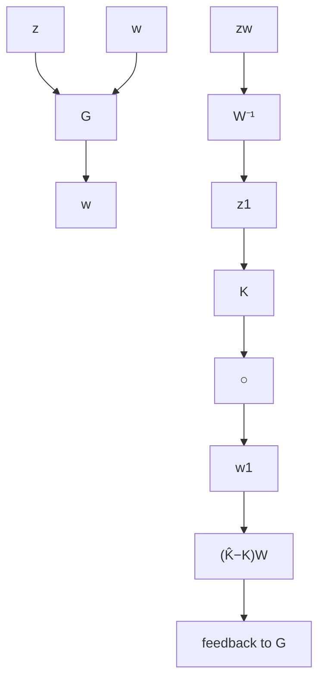

# 15.3 Problems

Problem 15.1 Find a lower-order controller for the system in Example 10.4 when $\gamma = 2$ .

Problem 15.2 Find a lower-order controller for Problem 14.3 when $\gamma = 1 . 1 \gamma _ { \mathrm { o p t } }$ where $\gamma _ { \mathrm { o p t } }$ is the optimal norm.

Problem 15.3 Find a lower-order controller for the HIMAT control problem in Problem 14.12 when $\gamma = 1 . 1 \gamma _ { \mathrm { o p t } }$ where $\gamma _ { \mathrm { o p t } }$ is the optimal norm. Compare the controller reduction methods presented in this chapter with other available methods.

Problem 15.4 Let G be a generalized plant and K be a stabilizing controller. Let $\Delta = \mathrm { d i a g } ( \Delta _ { p } , \Delta _ { k } )$ be a suitably dimensioned perturbation and let $T _ { \hat { z } \hat { w } }$ be the transfer matrix from ${ \hat { w } } = { \left[ \begin{array} { l } { w } \\ { w _ { 1 } } \end{array} \right] } { \mathrm { ~ t o ~ } } { \hat { z } } = { \left[ \begin{array} { l } { z } \\ { z _ { 1 } } \end{array} \right] }$ in the following diagram:

flowchart

Let W, $W ^ { - 1 } \in \mathcal { H } _ { \infty }$ be a given transfer matrix. Show that the following statements are equivalent:

$1 . \mu _ { \Delta } \left( \left[ \begin{array} { c c } { { I } } & { { 0 } } \\ { { 0 } } & { { W ^ { - 1 } } } \end{array} \right] T _ { \hat { z } \hat { w } } \right) < 1 ;$   
$\begin{array} { r } { 2 . \ \lVert \mathcal { F } _ { \ell } ( G , K ) \rVert _ { \infty } < 1 \ \mathrm { a n d } \ \big \lVert W ^ { - 1 } \mathcal { F } _ { u } ( T _ { \hat { z } \hat { w } } , \Delta _ { p } ) \big \rVert _ { \infty } < 1 \ \mathrm { f o r ~ a l l } \ \overline { { \sigma } } ( \Delta _ { p } ) \leq 1 ; } \end{array}$   
$3 . \ \left\| \boldsymbol { W } ^ { - 1 } T _ { z _ { 1 } w _ { 1 } } \right\| _ { \infty } < 1 \ \mathrm { a n d } \ \left\| \mathcal { F } _ { \ell } \left( \left[ \begin{array} { c c } { I } & { 0 } \\ { 0 } & { W ^ { - 1 } } \end{array} \right] T _ { \bar { z } \bar { w } } , \Delta _ { k } \right) \right\| _ { \infty } < 1 \ \mathrm { f o r ~ a l l } \ \overline { { \sigma } } ( \Delta _ { k } ) \leq 1 .$
