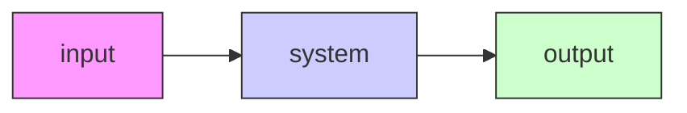

# 1.1 What is gain?

Gain is a proportional value that shows the relationship between the magnitude of an input signal to the magnitude of an output signal at steady-state. Many systems contain a method by which the gain can be altered, providing more or less “power” to the system.

Figure 1.1 shows a system with a hypothetical input and output. Since the output is twice the amplitude of the input, the system has a gain of 2.

flowchart

Figure 1.1: Demonstration of system with a gain of $K = 2$
