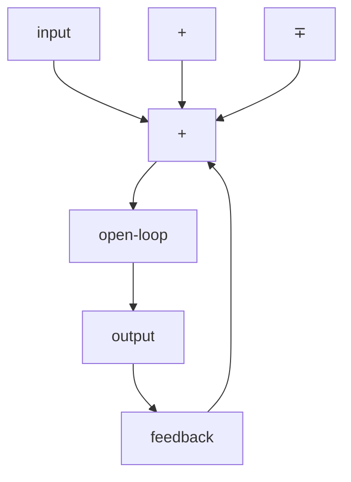
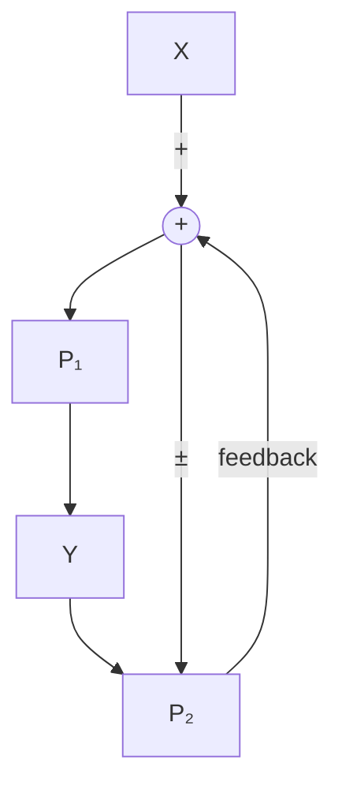

# 1.2 Block diagrams

When designing or analyzing a control system, it is useful to model it graphically. Block diagrams are used for this purpose. They can be manipulated and simplified systematically (see appendix A). Figure 1.2 is an example of one.

flowchart

Figure 1.2: Block diagram with nomenclature

The open-loop gain is the total gain from the sum node at the input (the circle) to the output branch. This would be the system’s gain if the feedback loop was disconnected. The feedback gain is the total gain from the output back to the input sum node. A sum node’s output is the sum of its inputs.

Figure 1.3 is a block diagram with more formal notation in a feedback configuration.

flowchart

Figure 1.3: Feedback block diagram

∓ means “minus or plus” where a minus represents negative feedback.
