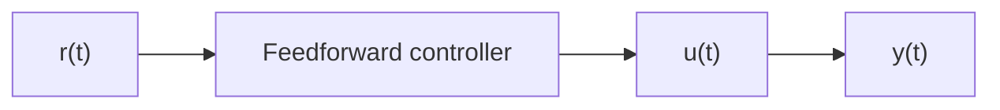
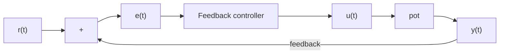

# 1.3 Open-loop and closed-loop systems

The system or collection of actuators being controlled by a control system is called the plant. A controller is used to drive the plant from its current state to some desired state (the reference). We’ll be using the following notation for relevant quantities in block diagrams.

r(t) reference u(t) control input

e(t) error y(t) output

Controllers which don’t include information measured from the plant’s output are called open-loop or feedforward controllers. Figure 1.4 shows a plant with a feedforward controller.

flowchart

Figure 1.4: Open-loop control system

Controllers which incorporate information fed back from the plant’s output are called closed-loop or feedback controllers. Figure 1.5 shows a plant with a feedback controller.

flowchart

Figure 1.5: Closed-loop control system

Note that the input and output of a system are defined from the plant’s point of view. The negative feedback controller shown is driving the difference between the reference and output, also known as the error, to zero.

Figure 1.6 shows a plant with feedforward and feedback controllers.

flowchart

