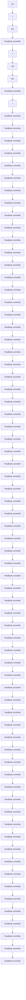

```mermaid
graph TD
    A["r(t)"] --> B["+"]
    B --> C["e(t)"]
    C --> D["Feedback controller"]
    D --> E["+"]
    E --> F["u(t)"]
    F --> G["y(t)"]
    G --> H["Feedback controller"]
    H --> I["+"]
    I --> J["Feedback controller"]
    J --> K["Feedback controller"]
    K --> L["Feedback controller"]
    L --> M["Feedback controller"]
    M --> N["Feedback controller"]
    N --> O["Feedback controller"]
    O --> P["Feedback controller"]
    P --> Q["Feedback controller"]
    Q --> R["Feedback controller"]
    R --> S["Feedback controller"]
    S --> T["Feedback controller"]
    T --> U["Feedback controller"]
    U --> V["Feedback controller"]
    V --> W["Feedback controller"]
    W --> X["Feedback controller"]
    X --> Y["Feedback controller"]
    Y --> Z["Feedback controller"]
    Z --> AA["Feedback controller"]
    AA --> AB["Feedback controller"]
    AB --> AC["Feedback controller"]
    AC --> AD["Feedback controller"]
    AD --> AE["Feedback controller"]
    AE --> AF["Feedback controller"]
    AF --> AG["Feedback controller"]
    AG --> AH["Feedback controller"]
    AH --> AI["Feedback controller"]
    AI --> AJ["Feedback controller"]
    AJ --> AK["Feedback controller"]
    AK --> AL["Feedback controller"]
    AL --> AM["Feedback controller"]
    AM --> AN["Feedback controller"]
    AN --> AO["Feedback controller"]
    AO --> AP["Feedback controller"]
    AP --> AQ["Feedback controller"]
    AQ --> AR["Feedback controller"]
    AR --> AS["Feedback controller"]
    AS --> AT["Feedback controller"]
    AT --> AU["Feedback controller"]
    AU --> AV["Feedback controller"]
    AV --> AW["Feedback controller"]
    AW --> AX["Feedback controller"]
    AX --> AY["Feedback controller"]
    AY --> AZ["Feedback controller"]
    AZ --> BA["Feedback controller"]
    BA --> BB["Feedback controller"]
    BB --> BC["Feedback controller"]
    BC --> BD["Feedback controller"]
    BD --> BE["Feedback controller"]
    BE --> BF["Feedback controller"]
    BF --> BG["Feedback controller"]
    BG --> BH["Feedback controller"]
    BH --> BI["Feedback controller"]
    BI --> BJ["Feedback controller"]
    BJ --> BK["Feedback controller"]
    BK --> BL["Feedback controller"]
    BL --> BM["Feedback controller"]
    BM --> BN["Feedback controller"]
    BN --> BO["Feedback controller"]
    BO --> BP["Feedback controller"]
    BP --> BQ["Feedback controller"]
    BQ --> BR["Feedback controller"]
    BR --> BS["Feedback controller"]
    BS --> BT["Feedback controller"]
    BT --> BU["Feedback controller"]
    BU --> BV["Feedback controller"]
    BV --> BW["Feedback controller"]
    BW --> BX["Feedback controller"]
    BX --> BY["Feedback controller"]
    BY --> BZ["Feedback controller"]
```

Figure 1.6: Control system with feedforward and feedback
