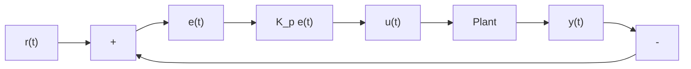

# Definition 2.1.1 — Proportional controller.

$$u (t) = K _ {p} e (t) \tag {2.1}$$

where $K _ { p }$ is the proportional gain and e(t) is the error at the current time t.

Figure 2.1 shows a block diagram for a system controlled by a P controller.   

flowchart

Figure 2.1: P controller block diagram

Proportional gains act like “software-defined springs” that pull the system toward the desired position. Recall from physics that we model springs as $F = - k x$ where F is the force applied, k is a proportional constant, and x is the displacement from the equilibrium point. This can be written another way as $F = k ( 0 - x )$ where 0 is the equilibrium point. If we let the equilibrium point be our feedback controller’s setpoint, the equations have a one-to-one correspondence.

$$F = k (r - x)u (t) = K _ {p} e (t) = K _ {p} (r (t) - y (t))$$

so the “force” with which the proportional controller pulls the system’s output toward the setpoint is proportional to the error, just like a spring.
