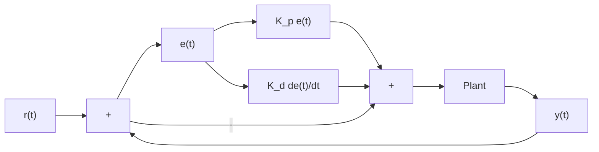

# 2.2 Derivative term

The Derivative term drives the velocity error to zero.

Definition 2.2.1 — PD controller.

$$u (t) = K _ {p} e (t) + K _ {d} \frac {d e}{d t} \tag {2.2}$$

where $K _ { p }$ is the proportional gain, $K _ { d }$ is the derivative gain, and $e ( t )$ is the error at the current time t.

Figure 2.2 shows a block diagram for a system controlled by a PD controller.

flowchart

Figure 2.2: PD controller block diagram

A PD controller has a proportional controller for position $( K _ { p } )$ and a proportional controller for velocity $( K _ { d } )$ . The velocity setpoint is implicitly provided by how the position setpoint changes over time. Figure 2.3 shows an example for an elevator.

To prove a PD controller is just two proportional controllers, we will rearrange the equation for a PD controller.

$$u _ {k} = K _ {p} e _ {k} + K _ {d} \frac {e _ {k} - e _ {k - 1}}{\Delta t}$$

where $u _ { k }$ is the control input at timestep $k , e _ { k }$ is the error at timestep $k ,$ , and $\Delta t$ is the timestep duration. $e _ { k }$ is defined as $e _ { k } = r _ { k } - y _ { k }$ where $r _ { k }$ is the setpoint at timestep k and $y _ { k }$ is the output at timestep k.

$$u _ {k} = K _ {p} (r _ {k} - y _ {k}) + K _ {d} \frac {(r _ {k} - y _ {k}) - (r _ {k - 1} - y _ {k - 1})}{\Delta t}u _ {k} = K _ {p} (r _ {k} - y _ {k}) + K _ {d} \frac {r _ {k} - y _ {k} - r _ {k - 1} + y _ {k - 1}}{\Delta t}u _ {k} = K _ {p} (r _ {k} - y _ {k}) + K _ {d} \frac {r _ {k} - r _ {k - 1} - y _ {k} + y _ {k - 1}}{\Delta t}u _ {k} = K _ {p} (r _ {k} - y _ {k}) + K _ {d} \frac {(r _ {k} - r _ {k - 1}) - (y _ {k} - y _ {k - 1})}{\Delta t}$$

line

| Time (s) | Position (m) | Velocity (m/s) | Voltage (V) |
| --- | --- | --- | --- |
| 0 | 0 | 0 | 0 |
| 1 | 1 | 0.4 | 4 |
| 2 | 2 | 0.4 | 4 |
| 3 | 3 | 0.4 | 4 |
| 4 | 4 | 0.4 | 4 |
| 5 | 5 | 0.4 | 4 |
| 6 | 6 | 0.4 | 4 |
| 7 | 7 | 0 | 0 |

Figure 2.3: PD controller on an elevator

$$u _ {k} = K _ {p} (r _ {k} - y _ {k}) + K _ {d} \left(\frac {r _ {k} - r _ {k - 1}}{\Delta t} - \frac {y _ {k} - y _ {k - 1}}{\Delta t}\right)$$

Notice how $\frac { r _ { k } - r _ { k - 1 } } { \Delta t }$ is the velocity of the setpoint and $\frac { y _ { k } - y _ { k - 1 } } { \Delta t }$ is the estimated velocity of the system. This means the $K _ { d }$ term of the PD controller drives the estimated velocity to the setpoint velocity.

If the setpoint is constant, the implicit velocity setpoint is zero, so the $K _ { d }$ term slows the system down if it’s moving. This acts like a “software-defined damper”. These are commonly seen on door closers, and their damping force increases linearly with velocity.
