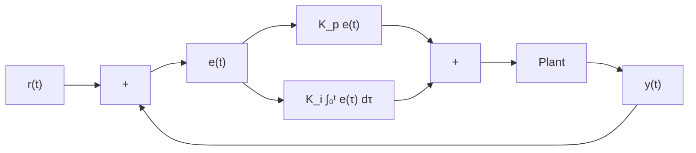

# 2.3 Integral term

The Integral term accumulates the area between the setpoint and output plots over time (i.e., the integral of position error) and adds the current total to the control input. Accumulating the area between two curves is called integration.

Definition 2.3.1 — PI controller.

$$u (t) = K _ {p} e (t) + K _ {i} \int_ {0} ^ {t} e (\tau) d \tau \tag {2.3}$$

where $K _ { p }$ is the proportional gain, $K _ { i }$ is the integral gain, e(t) is the error at the current time t, and τ is the integration variable.

The integral integrates from time 0 to the current time t. We use τ for the integration because we need a variable to take on multiple values throughout the integral, but we can’t use t because we already defined that as the current time.

Figure 2.4 shows a block diagram for a system controlled by a PI controller.

flowchart

Figure 2.4: PI controller block diagram

When the system is close to the setpoint in steady-state, the proportional term may be too small to pull the output all the way to the setpoint, and the derivative term is zero. This can result in steady-state error, as shown in figure 2.5.

A common way of eliminating steady-state error is to integrate the error and add it to the control input. This increases the control effort until the system converges. Figure 2.5 shows an example of steady-state error for a flywheel, and figure 2.6 shows how an integrator added to the flywheel controller eliminates it. However, too high of an integral gain can lead to overshoot, as shown in figure 2.7.

There are better approaches to fix steady-state error like using feedforwards or constraining when the integral control acts using other knowledge of the system. We will discuss these in more detail when we get to modern control theory.

line

| Time (s) | Setpoint (rad/s) | Output (rad/s) |
| --- | --- | --- |
| 0 | 900 | 0 |
| 5 | 900 | 850 |
| 10 | 0 | 0 |

