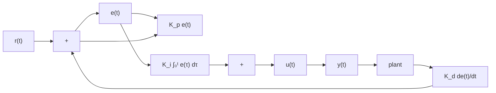

# Definition 2.4.1 — PID controller.

$$u (t) = K _ {p} e (t) + K _ {i} \int_ {0} ^ {t} e (\tau) d \tau + K _ {d} \frac {d e}{d t} \tag {2.4}$$

where $K _ { p }$ is the proportional gain, $K _ { i }$ is the integral gain, $K _ { d }$ is the derivative gain, e(t) is the error at the current time t, and τ is the integration variable.

Figure 2.8 shows a block diagram for a system controlled by a PID controller.   

flowchart

Figure 2.8: PID controller block diagram
