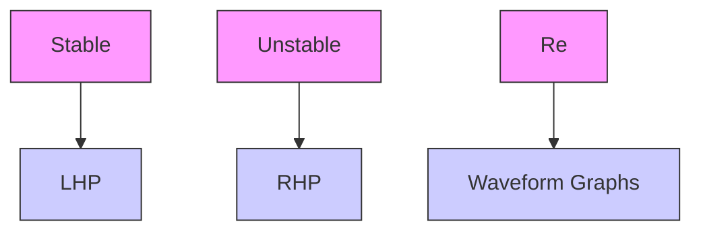

Imaginary poles always come in complex conjugate pairs $( \mathbf { e . g . , - 2 + 3 i , - 2 - }$ 3i).

“What is Euler’s formula actually saying? | Ep. 4 Lockdown live math” (51 minutes)

3Blue1Brown

https://youtu.be/ZxYOEwM6Wbk

flowchart

Figure 6.1: Continuous impulse response vs pole location
