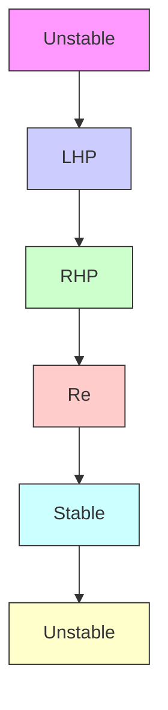

# 7.1.2 Discrete system behavior

Figure 7.2 shows the impulse responses in the time domain for systems with various pole locations in the complex plane (real numbers on the x-axis and imaginary numbers on the y-axis). Each response has an initial condition of 1.

flowchart

Figure 7.2: Discrete impulse response vs pole location

As ω increases in $s = j \omega$ , a pole in the discrete plane moves around the perimeter of the unit circle. Once it hits $\frac { \omega _ { s } } { 2 }$ (half the sampling frequency) at (−1, 0), the pole wraps around. This is due to poles faster than the sample frequency folding down to below the sample frequency (that is, higher frequency signals alias to lower frequency ones).

Placing the poles at (0, 0) produces a deadbeat controller. An $\mathrm { N } ^ { \mathrm { t h } }$ -order deadbeat controller decays to the reference in N timesteps. While this sounds great, there are other considerations like control effort, robustness, and noise immunity.

Poles in the left half-plane cause jagged outputs because the frequency of the system dynamics is above the Nyquist frequency (twice the sample frequency). The discretized signal doesn’t have enough samples to reconstruct the continuous system’s dynamics. See figures 7.3 and 7.4 for examples.

line

| Time (s) | Single pole in RHP | Single pole in LHP |
| --- | --- | --- |
| 0 | 0.0 | 0.0 |
| 1 | 2.5 | 0.6 |
| 2 | 2.5 | 0.6 |
| 3 | 2.5 | 0.6 |
| 4 | 2.5 | 0.6 |
| 5 | 2.5 | 0.6 |
| 6 | 2.5 | 0.6 |

Figure 7.3: Single poles in various locations in discrete plane

line

| Time (s) | Complex conjugate poles in LHP | Complex conjugate poles in RHP |
| --- | --- | --- |
| 0 | 1.0 | 0.0 |
| 0.5 | 0.5 | 3.0 |
| 1.0 | 0.6 | 1.5 |
| 1.5 | 0.4 | 2.2 |
| 2.0 | 0.4 | 1.8 |
| 2.5 | 0.4 | 1.9 |
| 3.0 | 0.4 | 1.9 |
| 3.5 | 0.4 | 1.9 |
| 4.0 | 0.4 | 1.9 |
| 4.5 | 0.4 | 1.9 |
| 5.0 | 0.4 | 1.9 |
| 5.5 | 0.4 | 1.9 |
| 6.0 | 0.4 | 1.9 |

Figure 7.4: Complex conjugate poles in various locations in discrete plane
