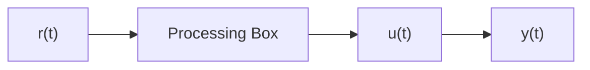

# 7.8.1 Plant inversion

Plant inversion is a method of model-based feedforward that solves the plant for the input that will make the plant track a desired state. This is called inversion because in a block diagram, the inverted plant feedforward and plant cancel out to produce a unity system from input to output.

flowchart

Figure 7.10: Open-loop control system with plant inversion feedforward

While it can be an effective tool, the following should be kept in mind.

1. Don’t invert an unstable plant. If the expected plant doesn’t match the real plant exactly, the plant inversion will still result in an unstable system. Stabilize the plant first with feedback, then inject an inversion.

2. Don’t invert a nonminimum phase system. The advice for pole-zero cancellation in subsection E.2.2 applies here.
