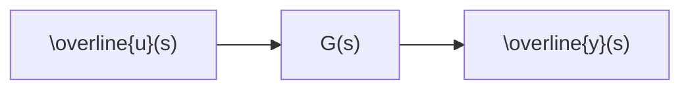

# 1.2.2 Input-Output Models

If we know little about the internal structure of a system, it may be convenient to take another approach in which we suppress the state variable, and focus attention only on the manipulatable inputs and measurable outputs. As shown in Figure 1.1, we consider the system to be the connection between u and y. In this viewpoint, we usually perform system identification experiments in which we manipulate u and measure y, and develop simple linear models for G. To take advantage of the usual block diagram manipulation of simple series and feedback connections, it is convenient to consider the Laplace transform of the signals rather than the time functions,

$$\overline {{{y}}} (s) := \int_ {0} ^ {\infty} e ^ {- s t} y (t) d t$$

in which $s \in \mathbb { C }$ is the complex-valued Laplace transform variable, in contrast to t, which is the real-valued time variable. The symbol := means “equal by definition” or “is defined by.” The transfer function matrix is then identified from the data, and the block diagram represents the following mathematical relationship between input and output

$$\overline {{{{\mathcal {Y}}}}} (s) = G (s) \overline {{{{u}}}} (s)$$

$G ( s ) \in \mathbb { C } ^ { p \times m }$ is the transfer function matrix. Notice the state does not appear in this input-output description. If we are obtaining G(s) instead from a state space model, then $G ( s ) = C ( s I - A ) ^ { - 1 } B$ , and we assume $x ( 0 ) = 0$ as the system initial condition.

flowchart

Figure 1.1: System with input u, output $\overline { { y } }$ and transfer function matrix G connecting them; the model is ${ \overline { { y } } } = G { \overline { { u } } }$ .
