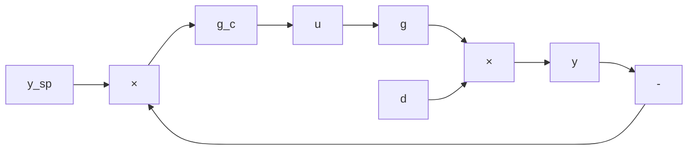

# Exercise 1.59: Choose a sample time

Consider the unstable continuous time system

$$\frac {d x}{d t} = A x + B u \quad y = C x$$

in which

$$
A = \left[ \begin{array}{c c c c} - 0. 2 8 1 & 0. 9 3 5 & 0. 0 3 5 & 0. 0 0 8 \\ 0. 0 4 7 & - 0. 1 1 6 & 0. 0 5 3 & 0. 3 8 3 \\ 0. 6 7 9 & 0. 5 1 9 & 0. 0 3 0 & 0. 0 6 7 \\ 0. 6 7 9 & 0. 8 3 1 & 0. 6 7 1 & - 0. 0 8 3 \end{array} \right] \quad B = \left[ \begin{array}{l} 0. 6 8 7 \\ 0. 5 8 9 \\ 0. 9 3 0 \\ 0. 8 4 6 \end{array} \right] \quad C = I
$$

Consider regulator tuning parameters and constraints

$$
Q = \operatorname{diag} (1, 2, 1, 2) \qquad R = 1 \qquad N = 1 0 \qquad | x | \leq \left[ \begin{array}{c} 1 \\ 2 \\ 1 \\ 3 \end{array} \right]
$$

(a) Compute the eigenvalues of A. Choose a sample time of $\Delta = 0 . 0 4$ and simulate the MPC regulator response given $x ( 0 ) = \left\lceil - 0 . 9 - 1 . 8 0 . 7 2 \right\rceil ^ { \prime }$ 0 until $t = 2 0$ . Use an ODE solver to simulate the continuous time plant response. Plot all states and the input versus time.

Now add an input disturbance to the regulator so the control applied to the plant is $u _ { d }$ instead of u in which

$$u _ {d} (k) = (1 + 0. 1 w _ {1}) u (k) + 0. 1 w _ {2}$$

and $\boldsymbol { w } _ { 1 }$ and $w _ { 2 }$ are zero mean, normally distributed random variables with unit variance. Simulate the regulator’s performance given this disturbance. Plot all states and ${ \boldsymbol { u } } _ { d } ( { \boldsymbol { k } } )$ versus time.

flowchart

Figure 1.13: Feedback control system with output disturbance $^ { d , }$ and setpoint $y _ { \mathrm { s p } }$ .

(b) Repeat the simulations with and without disturbance for $\Delta = 0 . 4$ and $\Delta = 2$

(c) Compare the simulations for the different sample times. What happens if the sample time is too large? Choose an appropriate sample time for this system and justify your choice.
