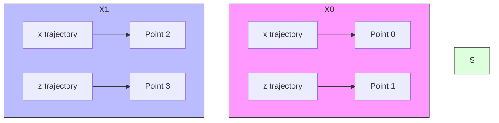

and S is an outer approximation of $S _ { K } ( \infty ) \left( S _ { K } ( \infty ) \subseteq S \right)$ . It follows from the previous discussion that if $x ( 0 ) \in \{ z ( 0 ) \} \oplus S _ { K } ( \infty )$ and S is merely an outer approximation of $S _ { K } ( \infty )$ or if $x ( 0 ) ~ \in ~ \{ z ( 0 ) \}$ ⊕ S where S is a robust positive invariant outer approximation of $S _ { K } ( \infty )$ (Rakovi´c, Kerrigan, Kouramas, and Mayne, 2005a), then $e ( i )$ lies in S for all $i \in$ $\mathbb { I } _ { \ge 0 }$ , and every state trajectory $\{ x ( i ) \}$ of $x ^ { + } = A x + B ( \nu + K e ) + w$ , $w \in \mathbb { W }$ . In other words, each trajectory corresponding to an admissible realization of w, lies in the tube $X ( z , \mathbf { v } )$ , as shown in Figure 3.4. An obvious choice for $z ( 0 )$ that ensures $e ( 0 ) \ \in \ S _ { K } ( \infty ) \ { \mathrm { i s } } \ z ( 0 ) \ = \ x ( 0 )$ . Similarly every control trajectory $\{ u ( i ) \}$ of the uncertain system lies in the tube $\{ \{ \nu ( i ) \}$ ⊕ $K S _ { K } ( \infty ) \}$ or in the tube $\{ \{ \nu ( i ) \} \oplus K S \}$ .

The fact that the state and control trajectories of the uncertain system lie in known neighborhoods of the state and control trajectories, $\{ z ( i ) \}$ } and $\{ \nu ( i ) \}$ } respectively, is the basis for tube-based MPC described subsequently. It follows from this fact that if $\{ z ( i ) \}$ and $\{ \upsilon ( i ) \}$ are chosen to satisfy $\{ z ( i ) \}$ ⊕ $S _ { K } ( \infty ) \subseteq \mathbb { X }$ and $\{ \upsilon ( i ) \}$ ⊕ $K S _ { K } ( \infty ) \subseteq \mathbb { V }$ for all $i \in  { \mathbb { I } } _ { \geq 0 }$ , then $x ( i ) \in \mathbb { X }$ and $u ( i ) \in \mathbb { U }$ for all $i \in \mathbb { I } _ { \geq 0 }$ . Thus $\{ z ( i ) \}$ and $\{ \upsilon ( i ) \}$ should be chosen to satisfy the tighter constraints $z ( i ) \in \mathbb { Z }$ and $\nu ( i ) \in \mathbb { V }$ for all $i \in  { \mathbb { I } } _ { \geq 0 }$ where $\mathbb { Z } : = X \ominus S$ and $\mathbb { V } : = U \ominus K S$ in which $S = S _ { K } ( \infty )$ or is an outer approximation of $S _ { K } ( \infty )$ . If $K = 0$ , because A is strongly stable, X and V should be chosen to satisfy $\mathbb { Z } = X \ominus S$ and $\mathbb { V } ~ = ~ { \textrm { \textmu } } U$ , i.e., there is no need to tighten the constraint on v. It may seem that it is necessary to compute $S _ { K } ( \infty )$ , or a robust positive invariant outer approximation S, which is known to be difficult, in order to employ this approach. This is not the case, however; we show later that the tighter constraint sets Z and V may be relatively simply determined.

flowchart

Figure 3.4: Outer-bounding tube X(z, v); Xi = {z(i)} ⊕ S.
