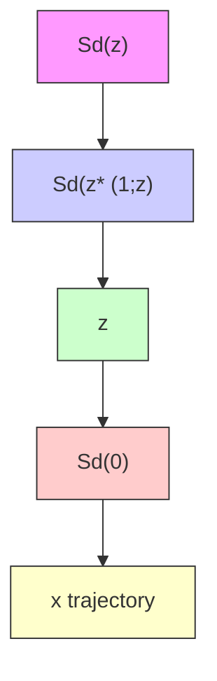

# 3.6.4 Analysis

Because of the nonlinearity and the terminal equality constraint in problem $\mathbb { P } _ { N } ( x , z )$ , analysis is technical and requires use of the implicit function theorem. Full details appear on the website www.che. $\mathsf { w i s c }$ . $\mathsf { e d u } / { \sim } \mathsf { j b r a w / m p c }$ and the references cited there. Here we give an outline of the analysis. Ideally we would like, as in the linear case, to have a constant set S such that given $z ( i )$ , the state of the nominal system at time i, we could assert that the state $x ( i )$ of the uncertain system lies in $\{ z ( i ) \} \oplus S$ . Instead, as we show subsequently, for each state $z ( i )$ of the nominal system, the state $x ( i )$ of the uncertain system lies, for some $d > 0$ , in the set $S _ { d } ( z ( i ) )$ ) where the set-valued $S _ { d } ( \cdot )$ is defined, for all $z \in \mathcal { Z } _ { N }$

$$S _ {d} (z) := \{x \in \mathbb {R} ^ {n} \mid V _ {N} ^ {0} (x, z) \leq d \}$$

The set $S _ { d } ( z )$ is a sublevel set of the function $x \ \mapsto \ V _ { N } ^ { 0 } ( x , z )$ . Since $S _ { 0 } ( z ) = \{ z \}$ , the set $S _ { d } ( z )$ is a neighborhood of z. The set $S _ { d } ( z )$ , that varies with z, replaces the set $\{ z \}$ ⊕ S employed in Section 3.4 because of the following important property that holds under certain controllability and differentiability assumptions:

Proposition 3.21 (Existence of tubes for nonlinear systems). There exists a d $> 0$ such that if the state $( x , z )$ of the composite system (3.52) and (3.53) lies in $\mathcal { M } _ { N }$ and satisfies $x \in S _ { d } ( z )$ , then the successor state $( x ^ { + } , z ^ { + } )$ satisfies $x ^ { + } \in S _ { d } ( z ^ { + } )$ , i.e.,

$$x ^ {+} = f (x, \kappa_ {N} (x, z)) + w \in S _ {d} (z ^ {+}) \qquad z ^ {+} = f (z, \bar {\kappa} _ {N} (z))$$

for all w satisfying $| w | \leq ( 1 - \gamma ) d / k ( z )$ where $k ( z )$ is a local Lipschitz constant for $x \mapsto V _ { N } ^ { 0 } ( x , z )$ .

If $w \in \mathbb { W }$ implies $| w | \leq ( 1 - \gamma ) d / k$ where k is an upper bound for $k ( z )$ in ${ \mathcal { Z } } _ { N }$ , then every solution of the system $x ^ { + } = f ( x , \kappa _ { N } ( x , z ) ) + w$ , $w \in \mathbb { W }$ lies in the tube $\mathbf { S } : = \{ S _ { d } ( z ) , S _ { d } ( z ^ { * } ( 1 ; z ) ) , S _ { d } ( z ^ { * } ( 2 ; z ) ) , . . . \}$ for all disturbance sequences $\{ w ( i ) \}$ satisfying $w ( i ) \in \mathbb { W }$ for all $i \in \mathbb { I } _ { \geq 0 }$ . Figure 3.5 illustrates this result and the fact that the cross-section of the tube varies with the state of the nominal system.

flowchart

Figure 3.5: Tube for a nonlinear system.
