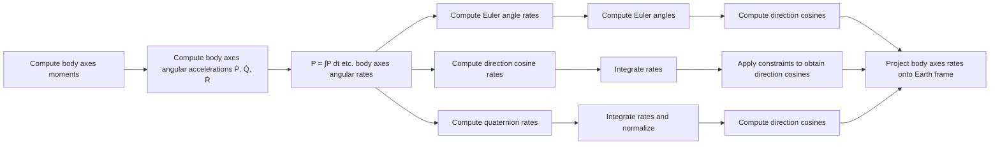

Fig. 2.5. Rotational dynamics of a rigid body.

$$\frac {d P}{d t} = Q R [ (I _ {y} - I _ {z}) / I _ {x} ] + (L / I _ {x}), \tag {2.46a}\frac {d Q}{d t} = P R [ (I _ {z} - I _ {x}) / I _ {y} ] + (M / I _ {y}), \tag {2.46b}\frac {d R}{d t} = P Q [ (I _ {x} - I _ {y}) / I _ {z} ] + (N / I _ {z}). \tag {2.46c}$$

The relationship of the three coordinate systems discussed in Section 2.1 can be described in terms of the body dynamics. Figure 2.5 illustrates the manner in which these three methods are integrated into computational sequence of representing the vehicle dynamics.

The equations for the angular velocities $( d \psi / d t , d \phi / d t , d \theta / d t )$ in terms of the Euler angles $( \psi , \phi , \theta )$ and the rates $( P , Q , R )$ can be written from Figure 2.1 as follows [1]:

$$\frac {d \psi}{d t} = (Q \sin \phi + R \cos \phi) / \cos \theta , \tag {2.47a}\frac {d \phi}{d t} = P + \left(\frac {d \psi}{d t}\right) \sin \theta , \tag {2.47b}\frac {d \theta}{d t} = Q \cos \phi - R \sin \phi , \tag {2.47c}$$

where P is the roll rate, Q is the pitch rate, and R is the yaw rate. The values of $( \psi , \phi , \theta )$ can be obtained by integrating (2.47a)–(2.47c). Thus,

$$\psi = \psi_ {0} + \int_ {0} ^ {t} \left(\frac {d \psi}{d t}\right) d t, \tag {2.48a}\phi = \phi_ {0} + \int_ {0} ^ {t} \left(\frac {d \phi}{d t}\right) d t, \tag {2.48b}\theta = \theta_ {0} + \int_ {0} ^ {t} \left(\frac {d \theta}{d t}\right) d t. \tag {2.48c}$$

From the transformation matrix $C _ { e } ^ { b }$ of Section 2.1, the components of the missile velocity $d X _ { e } / d t , d Y _ { e } / d t , d Z _ { e } / d t$ in the Earth-fixed coordinate system $( X _ { e } , Y _ { e } , Z _ { e } )$ in terms of $( u , v , w )$ and $( \psi , \phi , \theta )$ are given as follows:
