# (c) Aerodynamic Yawing Moment

The aerodynamic yawing moment N is a function of yaw rate R as well as $\alpha _ { y }$ and $\delta _ { y }$ . Now, define the components of the yawing moment as follows:

$$N = N _ {o} + N _ {r}, \tag {3.31}$$

text_image

Control surfaces
(tail fins)
Canards
Yb ⊙ +M
Yb cg
Zb
Xb
Tail
+δ
+Fn
+δ
Canard
+δ
Xb
Airflow
Zb

= Positive deflection of control surface, measured with respect to $X _ { b ^ { - } }$ -axis; positive for anti-clockwise sense of rotation about the hinge looking into the $Y _ { b } .$ -axis towards the missile body.

Tail - Positive deflection as shown is producing:

1) Negative Pitching Moment (ÐM) about the cg.

2) Positive Normal Force $( + F _ { N } )$

Canard - Positive deflection as shown producing:

1) Positive Pitching Moment (+M) about the cg.

2) Positive Normal force $( + F _ { N } )$ .

(a) X-Z (pitch) plane.   

```mermaid
graph TD
    A["Control surfaces (tail fins)"] --> B["Z_b"]
    B --> C["Y_b"]
    C --> D["X_b"]
    E["Canards"] --> F["Z_b ⊗ +N"]
    F --> G["X_b"]
    H["Tail"] --> I["Z_b"]
    I --> J["Y_b"]
    K["Canard"] --> L["F_Y (negative)"]
    L --> M["X_b"]
    N["Airflow"] --> O["+δ"]
    P["+δ"] --> Q["+δ"]
    R["+δ"] --> S["+δ"]
    T["+δ"] --> U["+δ"]
    V["+δ"] --> W["+δ"]
    X["+δ"] --> Y["+δ"]
    Z["+δ"] --> AA["+δ"]
    AB["+δ"] --> AC["+δ"]
    AD["+δ"] --> AE["+δ"]
    AF["+δ"] --> AG["+δ"]
    AH["+δ"] --> AI["+δ"]
    AJ["+δ"] --> AK["+δ"]
    AL["+δ"] --> AM["+δ"]
    AN["+δ"] --> AO["+δ"]
    AP["+δ"] --> AQ["+δ"]
    AR["+δ"] --> AS["+δ"]
    AT["+δ"] --> AU["+δ"]
    AV["+δ"] --> AW["+δ"]
    AX["+δ"] --> AY["+δ"]
    AZ["+δ"] --> BA["+δ"]
    BB["+δ"] --> BC["+δ"]
    BD["+δ"] --> BE["+δ"]
    BF["+δ"] --> BG["+δ"]
    BH["+δ"] --> BI["+δ"]
    BJ["+δ"] --> BK["+δ"]
    BL["+δ"] --> BM["+δ"]
    BN["+δ"] --> BO["+δ"]
    BP["+δ"] --> BQ["+δ"]
    BR["+δ"] --> BS["+δ"]
    BT["+δ"] --> BU["+δ"]
    BV["+δ"] --> BW["+δ"]
    BX["+δ"] --> BY["+δ"]
    BZ["+δ"] --> BZ
    CA["+δ"] --> CA
    CB["+δ"] --> CB
    CC["+δ"] --> CC
    DD["+δ"] --> DD
    DE["+δ"] --> DE
    FD["+δ"] --> FD
    DG["+δ"] --> DG
    DH["+δ"] --> DH
    DI["+δ"] --> DI
    DJ["+δ"] --> DJ
    DK["+δ"] --> DK
    DL["+δ"] --> DL
    DV["+δ"] --> DV
    DW["+δ"] --> DW
    DX["+δ"] --> DX
    DXB["X_b"] --> DXB
    DXB --> DXC["X_b"]
```

flowchart

