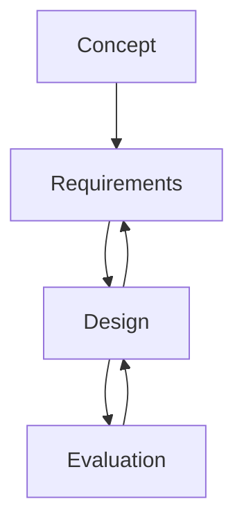

A European development of a new beyond-visual-range air-to-air missile (BVRAAM) would employ a Mach 3 ram-rocket propulsion system for increased range and reduced time to target. The ram-rocket motor would feature four inlets in the center of the missile body and high boron content in the sustainer propellant for high specific impulse with low volume. After being boosted to the required operating speed, the air-breathing ramjet sustainer would take over for the rest of the flight, mixing fuel-rich gas from a boron gas generator. The Raytheon Company also is offering a next-generation version of the AIM-120 AMRAAM, dubbed the future mediumrange air-to-air missile (FMRAAM). Raytheon’s FMRAAM design employs a liquid fuel ramjet developed by Aerospatiale Missiles. Still another European concept is to employ a solid fuel, variable flow ducted ramjet developed by Germany’s DASA subsidiary Bayern-Chemie. The Russian Kh-31, which has an active or passive RF seeker for antiship or antiradiation missions; is one of the few operational ramjet missiles; it flies at Mach 2.7 while sea-skimming. The Defense Advanced Research Projects Agency’s (DARPA) Affordable Rapid Response Missile Demonstration (ARRMD) is examining two different concepts: one from the Air Force’s HyTech program and the other from the Office of Naval Research’s Hypersonic Weapon Technology Program. The Aerojet Corporation, which builds the dual combustion ramjet (DCR), proposes a central subsonic ramjet combustor that feeds fuel-rich exhaust into the surrounding supersonic scramjet stream, where combustion is completed. Before we leave this topic, it should be pointed out that there is another type of propellant, namely, the hypergolic∗ propellant. This is a rocket propellant that ignites spontaneously upon contact with an oxidizer.

flowchart

Fig. 3.16. Missile development phases.
